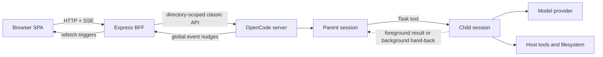
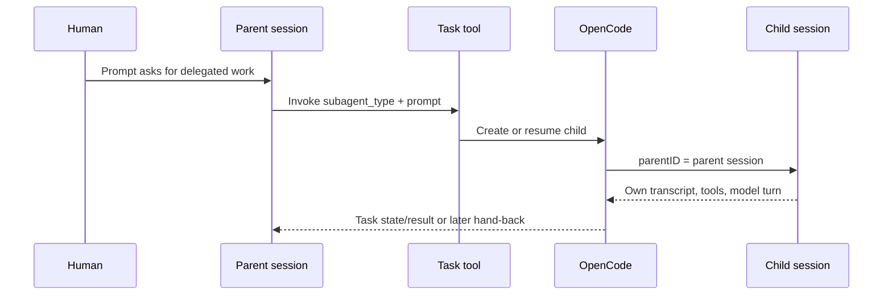
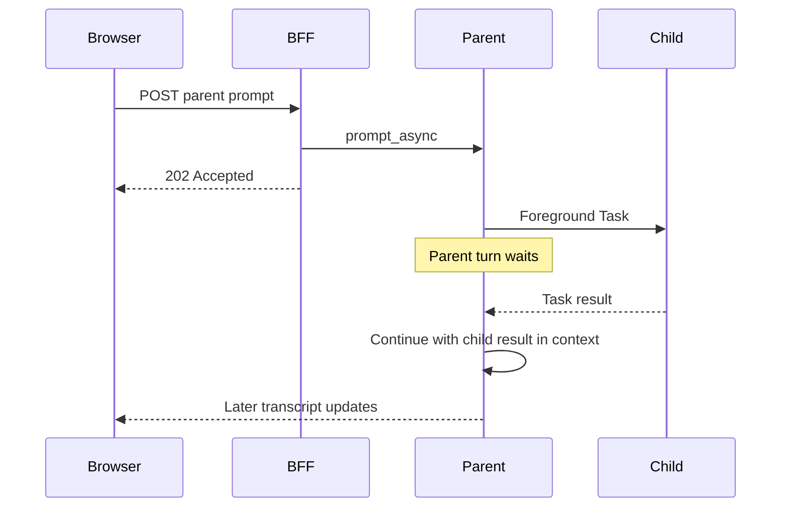
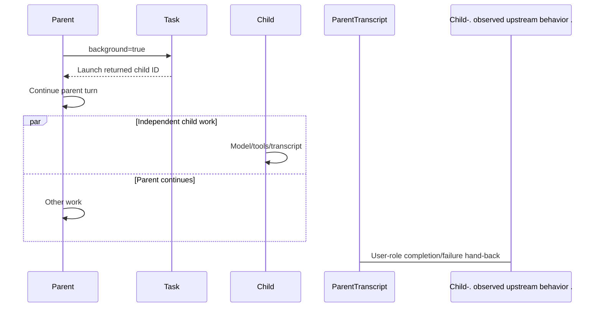
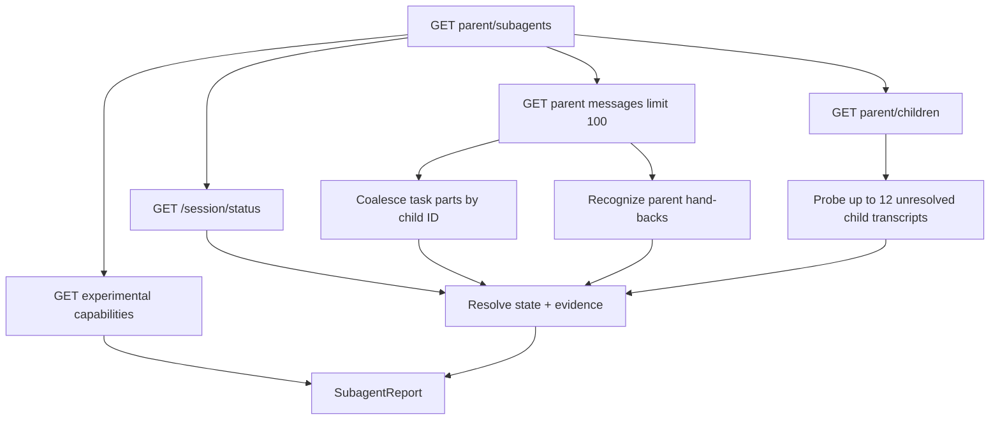
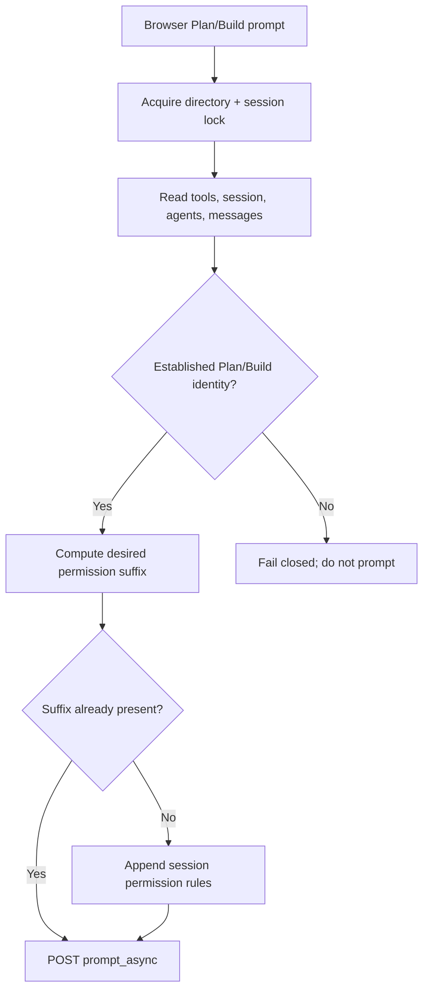

# How current OpenCode sub-agents work

Status: **Current-state explanation**

This guide explains the OpenCode sub-agent behavior implemented and observed by this repository.
It is not the persistent-side-agent proposal and does not describe a future messaging bridge.

## One-sentence model

An OpenCode sub-agent is an ordinary child session created by the parent's Task tool; OpenCode
owns its execution and transcript, while this application reconstructs an evidence-labelled child
ledger from several incomplete APIs.

```text
Parent agent invokes Task
        |
        v
OpenCode creates/resumes child session with parentID
        |
        +--> child owns a separate transcript and tool execution
        |
        +--> foreground: parent waits for Task result
        |
        `--> background: parent continues; hand-back may arrive later

Browser/BFF do not schedule the child.
They observe children, task parts, process status, and transcripts.
```

## Evidence legend

This distinction matters because deterministic tests can establish application behavior without
proving the live OpenCode implementation behind it.

| Label | Meaning |
|---|---|
| **Live-observed** | Captured or revalidated against OpenCode 1.18.21 |
| **Code-supported** | Production code depends on this contract and tests exercise it |
| **Mock-modelled** | Deterministic mock supplies the behavior; not independent live evidence |
| **Unverified** | Plausible or incident-suggested, but not a stable contract |

Live evidence confirms classic endpoints, immediate `prompt_async` acceptance, directory/global
event scoping, heartbeat behavior, and task metadata shapes. The exact lifecycle semantics of
foreground completion, background hand-back, permission inheritance, abort aftermath, and
experimental promotion remain application-supported rather than fully live-reprobed.

## Terminology

| Term | Meaning here |
|---|---|
| Parent session | Session whose agent invoked Task |
| Child session | Separate session with `parentID` pointing to the parent |
| Foreground Task | Parent Task call waits for child completion/result |
| Background Task | Launch returns quickly while child continues independently |
| Task part | Parent transcript tool part recording delegation intent and child metadata |
| Hand-back | Upstream user-role parent message that reports background child outcome |
| Derived ledger | BFF report combining children, task parts, status, and transcripts |
| Running status | Process-local `busy` or `retry` entry from `/session/status` |
| Unknown | Honest absence of terminal evidence, not a synonym for idle or failed |
| Promotion | Experimental parent-scoped conversion of eligible foreground work to background |

The durable relationship key is the **child session ID**. A resumed child can produce several Task
parts, so tool-part IDs are not stable job identifiers.

## System topology



*OpenCode owns session creation and execution. The BFF is an observer, permission/prompt gateway,
and ownership-checking control plane.*

## Creation and identity

Normal browser session creation creates a root. It does not accept `parentID`. A child is normally
created by OpenCode when the parent's Task tool invokes a sub-agent. A lower-level server helper
can create a linked session explicitly, but no browser route exposes that behavior.

```ts
interface ChildSession {
  id: string
  parentID: string
  directory?: string
  title?: string
  agent?: string
  cost?: number
  time?: { created?: number; updated?: number; archived?: number }
}
```

Session listings add `childCount` by grouping all sessions in a directory by `parentID`. A roots-
only list cannot provide honest child counts, so the BFF fetches the flat directory list first.



## Task metadata

The parent transcript carries delegation intent and correlation metadata:

```ts
{
  type: "tool",
  tool: "task",
  state: {
    status: "pending" | "running" | "completed" | "error",
    input: {
      description?: string,
      prompt?: string,
      subagent_type?: string,
      background?: true
    },
    metadata: {
      sessionId?: string,
      sessionID?: string,
      agent?: string,
      background?: true,
      model?: { providerID?: string, modelID?: string }
    },
    error?: string,
    title?: string,
    time?: { start?: number, end?: number }
  }
}
```

The server accepts either `sessionId` or `sessionID`. It coalesces every Task part referring to the
same child. Earliest launch and latest encountered status are retained; background becomes sticky
once observed.

One current discrepancy is worth knowing: the browser adapter accepts `background` from input or
metadata, while the server ledger only honors `metadata.background === true`. The mock currently
writes both, so deterministic E2E does not expose this difference.

## Foreground execution

Foreground describes the Task relationship, not browser transport. Browser prompts always use
asynchronous `prompt_async`; inside that OpenCode turn, the parent Task call waits for its child.



The ledger treats a completed foreground Task part as terminal because the supported contract says
the parent call waited. This is a repository-supported assumption rather than a dedicated child-
completion API.

## Background execution

Background launch returns quickly. A Task part marked `completed` means the launch call returned;
it does **not** prove that the child completed.



Observed hand-back text resembles a machine-authored message naming the child and outcome, but the
message role is `user`. Nothing upstream explicitly marks it synthetic. The application therefore
recognizes and re-renders likely hand-backs to avoid presenting them as human prompts.

Cancelled children have been observed without any hand-back. Missing notification is why the
ledger preserves `unknown` rather than guessing completion.

## The derived ledger

`GET /api/sessions/{parent}/subagents` does not proxy one upstream job endpoint. It builds a report.



### Upstream reads and bounds

1. Read process-local status.
2. In parallel, list authoritative children, newest 100 parent messages, and capabilities.
3. Skip transcript probes for children already running or with a recognized hand-back.
4. Sort remaining children newest-first.
5. Read at most 12 child transcripts, five messages each, concurrency four.
6. Return every child row; unprobed rows may remain unknown and `truncated` reports the cap.

Bounding these reads prevents one highly delegated parent from overwhelming the BFF. It also means
older launch metadata, hand-backs, and child terminal evidence can be absent from the report.

## State and evidence

```ts
type SubagentState = "launched" | "running" | "completed" | "failed" | "unknown"
type SubagentEvidence =
  | "session-status"
  | "child-transcript"
  | "parent-completion"
  | "parent-task-part"
  | "launch-only"
  | "no-terminal-evidence"
```

The pure resolver's documented precedence is:

| Priority | Condition | State | Evidence |
|---:|---|---|---|
| 1 | Status says `busy` or `retry` | running | session-status |
| 2 | Latest child assistant turn has error | failed | child-transcript |
| 2 | Latest child assistant turn has numeric completion | completed | child-transcript |
| 3 | Parent hand-back reports failure/success | failed/completed | parent-completion |
| 4 | Parent Task part errored | failed | parent-task-part |
| 5 | Foreground Task part completed | completed | parent-task-part |
| 6 | Task part pending/running | launched | launch-only |
| 7 | No terminal evidence | unknown | no-terminal-evidence |

### Effective precedence caveat

The orchestration skips child transcript probes when a recognized parent hand-back already exists.
Therefore the endpoint cannot normally discover contradictory child evidence for those rows.

```text
Pure resolver:       status > child transcript > parent hand-back > task part
Effective endpoint:  status > recognized hand-back (no probe) > transcript for others > task part
```

This is an implementation optimization with semantic consequences. Review the evidence label on a
row rather than assuming every completed row was verified from the child itself.

## Hand-back recognition

Server-side completion detection requires:

1. user-role message;
2. literal known child session ID;
3. success or failure outcome word.

Failure words are checked first, so “failed to complete” is failure. One message can settle several
known child IDs.

The client is stricter: it also requires a delegation word such as `background`, `sub-agent`,
`child session`, `delegated`, or `task`. This reduces false synthetic rendering, but can create a
disagreement: `ses_x completed` may settle the server ledger while still rendering as human prose.

## What is durable

| State | Owner | Restart behavior |
|---|---|---|
| Parent/child sessions and `parentID` | OpenCode storage | Expected to survive ordinary restart |
| Parent and child transcripts | OpenCode storage | Expected to survive ordinary restart |
| Task parts and hand-back messages | Parent transcript | Durable if written |
| Running/retry status | Connected OpenCode process | Lost on restart |
| Derived ledger | BFF request computation | Never persisted |
| Capability cache | BFF memory, 30 seconds | Lost on restart |
| Browser panel state | Browser component/query | Device/session local |
| Sub-agent notification history | BFF JSON history | Persisted but delivery-suppressed |

Absence from `/session/status` means “not currently owned by this process,” not completed, idle,
cancelled, or safe to resume. This is the most important negative-space rule in the system.

## Events and polling

One BFF connection consumes OpenCode `/global/event`, unwraps the directory envelope, tolerates
unknown event types, and fans them out over `/api/events`. Classic SSE has no replay cursor, so
events are only refresh nudges.

| Surface | Source of truth | Refresh behavior |
|---|---|---|
| Open conversation | HTTP transcript/todo/permission/question reads | Poll 3s; immediate poll on relevant SSE; hidden tab pauses |
| Subagents panel | Derived ledger endpoint | Load on selected tab; poll 10s only while running/launched |
| Hub hierarchy | Session list | Poll 10s; no SSE |
| Recents | Cross-project fan-out | Poll 60s |

Once every row is terminal or unknown, Subagents polling stops. A new delegation does not directly
restart that hook through SSE, so manual Refresh or tab/session reactivation may be necessary.

## Browser surfaces

### Hub hierarchy

The Hub transforms flat sessions into a recursive tree. Roots start visible; descendants are
collapsed. Parents show direct child counts, children show a `sub` pill, and indentation is capped
for mobile readability. Orphans and cycles remain visible rather than disappearing.

The list is capped at 100 sessions without a truncation indicator, so very large orchestration
projects can have incomplete hierarchy/counts.

### Parent task card

Task delegation renders as a dedicated card with status, duration, foreground/background, agent,
model, output/error disclosure, and an independent child-transcript link. It is excluded from
collapsed generic action groups so navigation is not lost.

The raw background tool card can visually say completed when only launch completed. The derived
ledger is the authoritative application interpretation.

### Child conversation

A child shows a `sub` badge, parent breadcrumb, and warning that follow-ups do not reach the parent.
Typical `explore` and `general` children cannot be prompted through the web composer because the
web path only accepts sessions established as Plan or Build. If a child is Plan/Build, direct
follow-ups remain in that child transcript and still do not propagate to the parent.

### Details/Subagents panel

Desktop shows a 320px inspector; mobile uses a full-height sheet. Rows include state, evidence,
agent, background flag, cost, age, failure detail, transcript link, and Stop when currently running.
The panel reports transcript-probe truncation and supports manual Refresh.

### Notifications

Server-side child activity is recorded in notification history with `suppressed: "subagent"` and
is hidden from rows and badge by default. Users can reveal the audit trail with the filter.

The browser's separate raw-SSE sound/speech watcher does not currently classify child ownership,
so local browser media may still fire for child events when enabled even though server delivery is
suppressed.

## Stop and promotion

### Stop

The UI shows Stop only when current process status makes the row `running`. Before forwarding abort,
the BFF fetches the child and verifies both canonical directory and `child.parentID === parentID`.
This is required because upstream abort accepts arbitrary session IDs.

The BFF route verifies ownership, not current liveness; API callers can race a child that already
stopped. After OpenCode restart, missing process ownership means the UI cannot honestly promise Stop.

### Run in background

Promotion is experimental and parent-scoped:

```http
POST /experimental/session/{parentID}/background?directory=...
```

The button appears only when a fail-closed capability probe reports support and at least one child
is running foreground. Upstream returns a boolean; false becomes conflict. No child ID is supplied,
so OpenCode chooses eligible synchronous work under that parent.

## Plan, Build, and Task permissions

Before every browser prompt, the BFF resolves the addressed session identity, tools, agent policies,
and recent messages. It serializes policy activation and `prompt_async` submission by directory and
session.



### Plan

Plan appends denies for discovered tools outside its read-oriented allowlist. `task` remains on the
allowlist, so the resolved Plan agent's pattern-specific Task permissions decide which child agent
types are allowed, asked, or denied.

### Build

A direct Build session without prior Plan denies remains under its resolved policy. Build after
Plan appends the resolved Build wildcard/tool-specific rules projected over discovered tools,
overriding historical Plan suffixes without granting an unconditional allow.

### Important rules

- Permission matching is last-match-wins.
- Session patches append; exact suffix checks keep activation idempotent.
- Never send non-empty legacy `prompt_async.tools`; those values persist as permission rules.
- The lock covers policy plus submission, not the whole turn, another BFF, TUI, or direct API.
- The BFF activates only the addressed session, not children created later by OpenCode.

## Child permission inheritance

Do not claim any of the following:

- child always inherits the parent's current mode;
- child follows later parent mode changes;
- child receives a stable creation-time snapshot.

The inheritance contract is unverified. Workflow validation observed children retaining terminal
Bash denies after a parent with Plan history returned to Build. Therefore a Build provenance badge
does not prove mutation capability.

**Operational rule:** use a fresh Build-only parent for mutating Task children. If child preflight
cannot run, stop; do not weaken policy or silently replace the child with an unrelated root session.

## Native worktree sub-agents

Two models must not be confused:

| Model | Session relationship | Directory behavior |
|---|---|---|
| Hub isolated workspace | New root session | Session is created in the new OpenCode worktree |
| Task child assigned sibling worktree | Preserves parent/child relationship | Child session remains scoped to parent's OpenCode directory |

Granting a Task child external worktree access does not change relative CWD, LSP/VCS/snapshot
scope, config, or event directory. A mutating child must use absolute worktree paths and `workdir`
on every shell call.

Required preflight:

```bash
pwd
git rev-parse --show-toplevel
git status --short --branch
```

Both roots must equal the assigned worktree. Otherwise stop without mutation.

## Nesting and reminders

OpenCode's default subagent depth is 1; this project sets `subagent_depth` to 3 so children can
delegate. The Settings page shows global configuration read-only, which can differ from project
override.

Repository reminders provide per-message orchestration contracts:

| Reminder | Use |
|---|---|
| `background-subagent` | One self-contained background child, no polling or duplicate work |
| `deep-research-subagents` | 3–5 non-overlapping read-only research children |
| `native-worktree-subagents` | Guarded mutating children in sibling worktrees |
| `build-waves` | Sequential mutation waves with only safe research overlap |
| `parallel-research-handoff` | Research then decision-closed isolated workers |

Reminder bodies remain server-side. The browser submits trusted IDs, the BFF appends the body for
that message, and the selection clears after send.

## Choosing the execution model

| Need | Prefer | Why |
|---|---|---|
| Small lookup | Parent/local work | Delegation overhead exceeds benefit |
| Independent read-only research | Several foreground/background Task children | Isolated context and concise evidence |
| Parent needs answer before continuing | Foreground Task | Direct synchronous result into parent turn |
| Independent work can finish later | Background Task | Parent continues, accepting completion uncertainty |
| Follow-up conversation with same child | TUI or direct API today | Typical child web composer is unsupported; replies stay child-local |
| Multiple code changes | Separate worktree per mutating child | Files/branches/indexes isolated |
| Shared file/port/DB/external state | Sequential work | Worktrees do not isolate shared resources |
| Fully independent implementation | Root session in isolated worktree | Clear ownership but no native parent hand-back |

## Failure and recovery matrix

| Symptom | Interpretation | Safe action |
|---|---|---|
| Background Task card says completed | Launch call returned | Inspect derived ledger/child transcript |
| Ledger says unknown | No terminal evidence | Refresh/open transcript; do not infer completion |
| No Stop | Connected process does not report child busy | Abort authority unavailable; do not promise cancellation |
| No promotion button | Capability absent or no eligible foreground child | Check capability and running rows |
| Child Bash denied after parent Build | Stale inherited Plan denies possible | Stop; use fresh Build-only parent |
| Child edits wrong checkout | External access did not change scope/CWD | Enforce absolute worktree contract and preflight |
| Nested child absent | Effective depth too low or list truncated | Check project config and child APIs |
| Panel stops changing | Settled/unknown rows stop polling | Manual Refresh or reopen tab |
| Older rows unknown | Child probe cap or parent-message cap reached | Look for truncation; inspect child directly |
| Hand-back renders as human prose | Client/server recognition signatures differ | Verify child ID/outcome and inspect raw transcript |
| Events missed after disconnect | Classic SSE has no replay | Wait for HTTP poll or refresh manually |

## Current limitations and discrepancies

1. Effective state precedence can favor hand-back without checking child transcript.
2. Server/client background metadata parsing differs.
3. Server/client hand-back signatures differ.
4. All-settled panel polling does not restart from transcript SSE.
5. Hub hierarchy silently caps at 100 sessions.
6. Ledger parent scan is 100 messages; child probing is 12 sessions.
7. Raw background Task cards can imply terminal completion too early.
8. Mobile inspector restores focus and handles Escape/history, but does not trap focus/inert background.
9. Browser media notifications can bypass server-side child suppression.
10. Deterministic mock abort/promotion do not model real post-action lifecycle changes.

These are current facts or risks, not proposals. They should inform interpretation and future work.

## What tests prove

| Test area | Proves |
|---|---|
| `session-mode-policy.test.ts` | Identity, Task pattern preservation, suffix idempotence, Build restoration |
| `subagents.test.ts` | Child ID extraction, resumed-part coalescing, evidence resolver, caps/unknown |
| `transcript-adapter.test.ts` | Task metadata and synthetic hand-back normalization |
| `subagents.api.spec.ts` | BFF report mapping, nesting, abort ownership, promotion response |
| `subagents.ui.spec.ts` | Hierarchy, cards, breadcrumbs, panel states, mobile access |
| `smoke.api.spec.ts` | Live-shaped policy sequencing against deterministic mock |

They do not independently prove live OpenCode permission inheritance, guaranteed hand-back,
permission append semantics, experimental promotion behavior, or real child execution in a sibling
worktree.

## Key implementation map

| Concern | Start here |
|---|---|
| Derived ledger and evidence | `server/opencode/subagents.ts` |
| Parent-scoped subagent routes | `server/routes/sessions.ts` |
| Session prompts/policy/status/abort | `server/opencode/sessions.ts` |
| Capability probe | `server/opencode/capabilities.ts` |
| Global SSE | `server/opencode/events.ts`, `server/opencode/client.ts` |
| Task/hand-back adapter | `client/lib/events.ts` |
| Hub hierarchy | `client/lib/subagents.ts`, `client/pages/Hub.tsx` |
| Delegation cards/status rows | `client/components/transcript.tsx` |
| Details ledger | `client/lib/useSubagents.ts`, `client/components/subagent-panel.tsx` |
| Child conversation | `client/pages/Conversation.tsx` |
| Permission tests | `tests/session-mode-policy.test.ts` |
| Lifecycle fixtures/tests | `tests/subagents.test.ts`, `tests/e2e/mock-opencode.ts` |

## Final mental model

```text
OpenCode child session     = durable conversation + execution boundary
Parent Task part           = delegation intent, not durable job truth
Process status             = strong positive liveness, weak negative evidence
Child final turn           = strongest asynchronous terminal evidence
Parent hand-back           = useful but heuristic completion evidence
Derived ledger             = bounded reconciliation view, rebuilt per request
Background completed part  = launch completed, not child completed
Unknown                    = correct answer when evidence is insufficient
```

See the [quick reference](current-opencode-subagents-reference.md),
[safe learning lab](current-opencode-subagents-lab.md), and
[interactive explainer](current-opencode-subagents.html) for complementary views.
