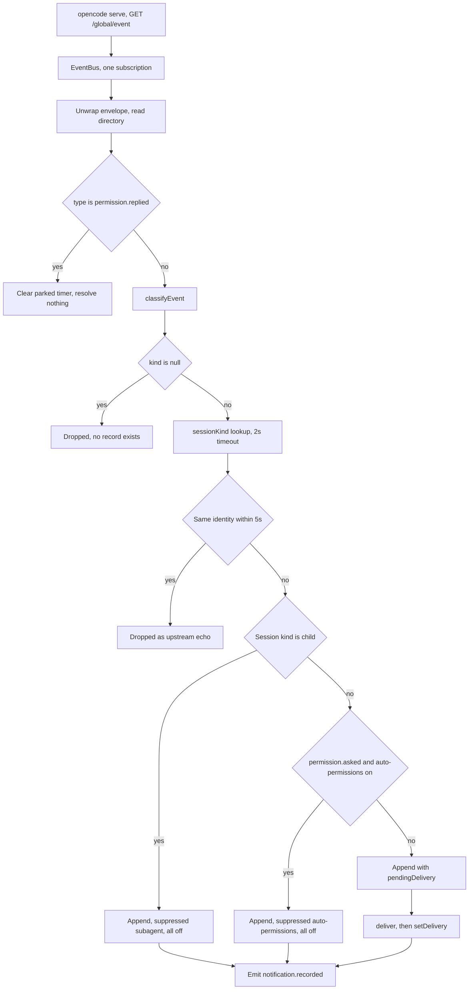
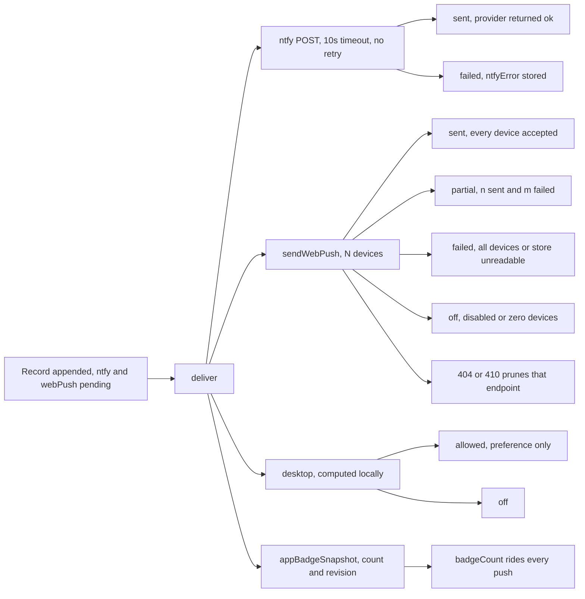
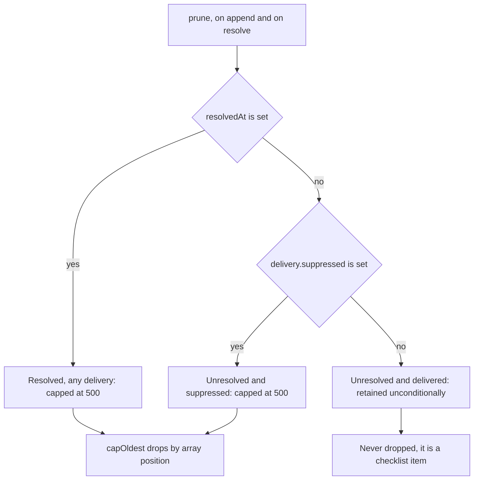
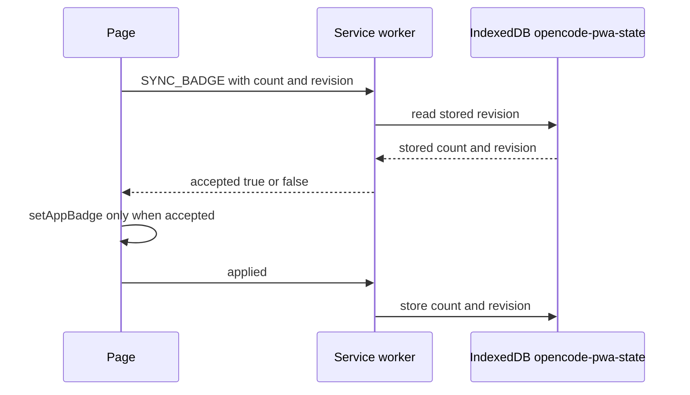
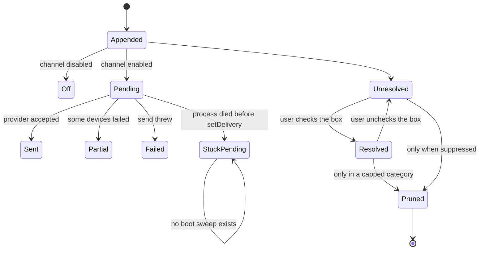

# Notification persistence and delivery

| Field | Value |
|---|---|
| Snapshot date | 2026-08-26 |
| Status | `Snapshot — not maintained` |
| Repository commit | `39d6f48` |
| Records | The notification pipeline as built: how the BFF (backend for frontend) classifies one upstream event stream into durable records, which of them it deliberately never delivers, how three independent delivery channels report what they actually did, and where the implementation and the prose already disagree. |

> **This is a point-in-time snapshot.** It describes the system as it stood at commit
> `39d6f48` and is deliberately not synchronized with the implementation. It will drift, and
> nobody will update it. When this document and the code disagree, the code wins. For current
> behaviour read [`docs/notifications.md`](../notifications.md) and the numbered decisions in
> `AGENTS.md` (#10, #10a, #10b, #11, #18), which remain the source of truth.

## 1. Overview

The notification subsystem turns one long-lived upstream event stream into a durable log of
every event the BFF judged worth telling a human about, then attempts delivery over three
independent channels. It occupies 1,536 lines of server code across five files —
`server/notifications/service.ts` (545), `history.ts` (429), `preferences.ts` (182),
`webpush.ts` (143) and `ntfy.ts` (40) — plus a 197-line route module and roughly 570 lines of
client code.

Two properties distinguish it from a conventional alerting path. First, a record is never
resolved by the system: only an explicit, reversible user checkbox clears it
(`history.ts:314-315`). An upstream `permission.replied` cancels the escalation timer and
resolves nothing (`service.ts:211-218`). Second, the log records what it refused to send.
Sub-agent activity and auto-approved permissions are appended with an all-`off` delivery
object and a `suppressed` reason (`service.ts:270`, `service.ts:283`), because "why was I never
pinged?" is a question the log exists to answer.

The subsystem has no metrics emission, no retry, no queue, no database and no shutdown hook. It
is a JSON file written atomically at mode `0600` (`history.ts:250-254`) by a single supervised
process.

## 2. Background

Notifications began as fire-and-forget: classify an event, POST to ntfy, discard. The header
comment on `history.ts:6-9` records the reason that stopped working — a red badge counting
outstanding work and a history list are two views over one record, so the record has to be
written somewhere both can read.

Three later pressures shaped what exists now. Sub-agent events were originally dropped at
ingest, which made "did my delegated child ever finish?" unanswerable (`service.ts:224-227`).
Auto-permissions answers permission requests before a human sees them, which made "why was I
never asked?" unanswerable. And installed PWAs (progressive web apps) can display an app-icon
badge, which requires a global count that survives the page being closed. Each pressure added a
requirement that a stateless pipeline could not meet.

## 3. Problem Statement

An agent working on the host produces events a human needs to act on — a permission request, a
question, an idle turn, an error — while that human is away from the machine. Three facts make
this harder than a webhook.

The BFF cannot observe delivery. It has no view of open browser tabs (`service.ts:442`,
`history.ts:12-15`), cannot see a phone's Do Not Disturb state, and cannot see device sound or
speech settings. Any record claiming "delivered" would be claiming something unobservable.

Not every classified event deserves a ping. A delegated child session's lifecycle is the
parent's business. A preapproved permission was never a decision the user owed anyone. But
discarding those events destroys the evidence needed to explain a missing ping.

An unresolved item is a checklist entry with no expiry. Nothing upstream tells the BFF that a
human has seen a notification, so an automatic sweep would be guessing, and any cap on
unresolved delivered records would silently discard work the user still owes.

## 4. Tenets

1. **Evidence of what was sent beats a clean inbox.** A tidy list that has forgotten the
   suppressed record cannot explain a missing ping, and explaining a missing ping is the more
   expensive failure. A reasonable team would prefer the inbox be short.
2. **Manual resolution beats automatic reconciliation.** An upstream reply proves the request
   was answered, not that the human saw the alert; automatic clearing would empty the inbox on
   the user's behalf. A reasonable team would prefer the badge track live upstream state.
3. **We never claim a delivery we cannot observe.** `desktop: "allowed"` says the preference was
   on and stops there (`history.ts:27-28`). A reasonable team would prefer an optimistic
   "sent" that is usually right.
4. **Losing the log beats dropping an alert.** A corrupt history file starts empty and silent
   rather than failing the notification path (`history.ts:235-240`). A reasonable team would
   prefer loud failure on corruption.
5. **A bounded audit trail beats unbounded truth.** Records that were never delivered are
   capped, because a busy project with auto-permissions enabled would otherwise grow the file
   forever (`history.ts:266-271`). A reasonable team would prefer to keep everything.
6. **One supervised process beats a better datastore.** A single Express process with a JSON
   tail is operationally cheaper than correctness against concurrent writers. A reasonable team
   would prefer SQLite.

*Unless you know better ones.*

## 5. Goals

We record every event the BFF classified, including the ones we chose not to send, making the
reason for non-delivery a field rather than an absence. We report each channel's outcome
separately, distinguishing "the provider accepted this" from "a human saw this". We keep an
unresolved delivered record until a human checks it off, and we keep the red counter, the row
list and the app-icon badge in agreement by deriving all three from one predicate. We survive a
corrupt state file, a malformed upstream frame, and an upstream server that disappears for an
hour.

## 6. Scope

### In Scope

Classification of the upstream global event stream into six notification kinds
(`preferences.ts:4`). Durable record persistence and retention. Suppression of sub-agent and
auto-approved events. Delivery over ntfy, Web Push and the browser desktop path. The installed
PWA app-icon badge and its revision handshake. Server-side noise filtering shared by rows and
counters. The nine HTTP routes in `server/routes/notifications.ts`.

### Out of Scope

Email, SMTP, webhooks, Slack, Telegram and SMS are absent; the only runtime notification
dependency is `web-push@^3.6.7`. Delivery receipts and read tracking are impossible from the
server. Retry and durable outbound queueing are absent. Device-local sound and speech are
performed by the browser and never represented in a record (`history.ts:13-15`). Per-user
routing does not exist because the deployment is single-tenant. Notification authoring by agents
is not a feature; records are only ever derived from upstream events or the parked timer.

## 7. Requirements

### User Requirements

| ID | Requirement | Priority |
|---|---|---|
| U1 | A permission request, question, error or idle turn reaches the user's phone while the browser is closed. | **P0** |
| U2 | An unresolved record stays in the list until the user explicitly checks it off. | **P0** |
| U3 | The user can discover why an expected ping never arrived. | **P0** |
| U4 | The red counter, the row list and the app badge never contradict each other. | **P0** |
| U5 | Lock-screen copy never leaks a path, URL, credential or session identifier. | **P0** |
| U6 | Resolution is reversible, so a mis-click is recoverable. | **P1** |
| U7 | The two suppressed categories are hidden by default but their cost is stated. | **P1** |
| U8 | A record names which piece of work it came from after that session is renamed or deleted. | **P1** |
| U9 | Row density and filter state persist per device. | **P2** |

### Technical Requirements

| ID | Requirement | Priority |
|---|---|---|
| T1 | Exactly one upstream subscription serves every project (`server/index.ts:53,74`). | **P0** |
| T2 | A corrupt, missing or unreadable state file must not fail the notification path. | **P0** |
| T3 | Channel credentials never reach the browser; only a `tokenConfigured` boolean does (`routes/notifications.ts:55`). | **P0** |
| T4 | The BFF cannot be used as an outbound request proxy via a registered push endpoint. | **P0** |
| T5 | Only `resolved` is mutable through the API (`routes/notifications.ts:157`). | **P0** |
| T6 | A malformed upstream frame must not terminate the stream (`server/opencode/events.ts:137-142`). | **P0** |
| T7 | Rows and counters apply one shared filter predicate (`history.ts:130-134`). | **P0** |
| T8 | Reconnect backoff is bounded and retries forever (`server/opencode/events.ts:39-40,91-92`). | **P1** |
| T9 | Suppressed appends must not wake another device's badge (`history.ts:308`). | **P1** |
| T10 | Session-lineage lookups are bounded in concurrency and time (`service.ts:385,391`). | **P1** |
| T11 | A repeat of the same upstream event within five seconds is not a second record (`service.ts:232-241`). | **P2** |

## 8. Assumptions and Dependencies

We assume one BFF process per state file. Requirement T1's single subscription and the atomic
rename in `history.ts:250-254` are both correct only under that assumption; two processes sharing
a path lose records (gap 8, §16). We assume the OpenCode server emits `session.created` and
`session.updated` before anything notifies, which is what makes the free lineage and title
classification at `service.ts:322-327` usually warm. We assume `NTFY_SERVER` is either absent or
a valid origin, because `trustedNtfyOrigin()` throws otherwise (`preferences.ts:65-72`).

Dependencies are: the upstream `GET /global/event` stream (`server/opencode/client.ts:74-75`);
`web-push@^3.6.7` for VAPID (Voluntary Application Server Identification) signing and payload
encryption; an ntfy server named by `NTFY_SERVER`; the four production browser push services
allowlisted at `webpush.ts:18,27`; and a launchd service definition under `deploy/`.

## 9. Proposed Design

### 9.1 One stream, demultiplexed once

The BFF holds a single subscription to `GET /global/event` (`server/opencode/events.ts:98`,
`server/opencode/client.ts:74-75`), not the directory-scoped `GET /event`, because a multi-project UI would
otherwise need one stream per project. Each frame is unwrapped and its `directory` field
becomes the record's project scope (`server/opencode/events.ts:144-152`). A frame that fails `JSON.parse` returns
without emitting and without throwing (`server/opencode/events.ts:137-142`); a frame with no `type` is ignored.
Reconnection doubles from one second to a thirty-second ceiling and never gives up
(`server/opencode/events.ts:39-40,91-92`).

**We subscribe once to the global stream and demultiplex on the envelope rather than opening one
stream per project.** *Two-way door.*
**Consequences: Positive.** One connection regardless of project count; a project the user has
never opened still produces notifications.
**Consequences: Negative.** Every event crosses one process, so a slow handler delays all
projects; the classic stream has no replay cursor, so a reconnect loses whatever arrived while
disconnected.

### 9.2 Classification, and the kind with no event

`classifyEvent` (`service.ts:12-23`) is a total function over five upstream types and returns
`null` for everything else, which drops the event before any record exists:

| Upstream event | Kind |
|---|---|
| `session.idle` | `idle` |
| `permission.asked` | `permission` |
| `question.asked` | `question` |
| `session.error` with `error.name === "MessageAbortedError"` | `abort` |
| `session.error` otherwise | `error` |
| anything else | `null`, dropped |

The sixth kind, `parked`, has no upstream event at all. It is synthesized by a timer scheduled
when a permission notification is delivered (`service.ts:302-304`) and fired
`parkedPermissionSeconds` later by `scheduleParked` (`service.ts:488-544`). Its default is 30
seconds (`preferences.ts:55`). `permission.replied` clears that timer and returns
(`service.ts:211-218`) — deliberately resolving nothing, because a reply is not evidence the
human saw the alert.

### 9.3 Lineage resolution fails open

Sub-agent suppression needs to know whether a session is a delegated child.
`SessionKind` is `"root" | "child" | "unknown"` (`service.ts:41`) and `sessionKind`
(`service.ts:354-380`) resolves it. Every uncertain path returns `"unknown"`, and only `"child"`
suppresses (`service.ts:228`). An event with no directory or no session id returns `"unknown"`
immediately (`service.ts:357`). A burst past four concurrent lookups returns `"unknown"` without
issuing a request (`service.ts:385`). The request itself carries
`AbortSignal.timeout(SESSION_LOOKUP_TIMEOUT_MS)` at two seconds (`service.ts:391,46`), and a
throw is warned and downgraded (`service.ts:396-398`). Verified answers cache for five minutes
and `"unknown"` for five seconds (`service.ts:370-374`), so an uncertain answer is retried soon
while a settled one is not.

**We fail open on lineage, so an unverifiable session notifies.** *Two-way door.*
**Consequences: Positive.** A transient upstream failure cannot silence a root session, which is
the expensive direction to be wrong in.
**Consequences: Negative.** Under a burst past the concurrency ceiling, genuine child sessions
notify and land in the inbox.

### 9.4 Two generators, two disclosure budgets

Outbound copy renders on a lock screen; in-app copy renders behind authentication. They are
separate functions with different limits.

| Property | `outboundMessage` (`service.ts:106-138`) | `inAppMessage` (`service.ts:144-164`) |
|---|---|---|
| Audience | Phone lock screen, ntfy and Web Push | Authenticated in-app row |
| Title | Session title capped at 80 (`service.ts:48`), else generic | none; the record's own `title` is used |
| Body cap | 140 (`service.ts:51`) | uncapped |
| Question preview | 100 (`service.ts:121`) | 240 (`service.ts:150`) |
| Priority | `high` for `parked` only (`service.ts:137`) | not applicable |
| Stored as | the outbound payload, never persisted | `displayBody` (`service.ts:263`) |

Both draw only from parsed fields, and every sanitizer rejects rather than redacts.
`safeToolName` accepts `/^[a-z][a-z0-9_-]{0,31}$/u` and returns `undefined` otherwise
(`service.ts:65-68`). `safePreview` (`service.ts:70-80`) drops any preview containing a path or
`~/`, a Windows drive letter, an `http(s)://` or `file://` URL, a `ses_`/`perm_`/`que_`
identifier, an `sk_`/`ghp_`/`github_pat_` token, or a `Bearer` header — the comment at
`service.ts:74-75` states the reason: the text comes from an upstream agent, so redacting
arbitrary tool output is not a game worth playing. `safeErrorReason` admits only a short
error-name shape (`service.ts:90-97`). A session title that looks like a session id is rejected
in favour of generic copy (`service.ts:113`).

The record's own `title` and `body` are generic operational strings, not the outbound copy
(`service.ts:247-250`).

### 9.5 Suppression is structural, not conditional

Two branches append and return before delivery is reachable. Sub-agent suppression requires a
directory, a session id and a resolved `"child"` (`service.ts:228,267-274`). Auto-permissions
suppression requires exactly `permission.asked` and an enabled directory
(`service.ts:280-287`), and is checked second, so a child permission in an auto-enabled
directory records as `subagent`.

`question.asked` is not suppressed by auto-permissions. That asymmetry is deliberate — auto
permissions answers permission requests and never answers questions — and is asserted at
`tests/notifications.test.ts:469-486`.

Three mechanisms make suppression hard to undo by accident. Both branches `return` before
`pendingDelivery` and `deliver` are reached. The delivery object is a hard-coded all-`off`
literal rather than a computed value, so a suppressed record cannot even claim intent
(`service.ts:270,283`). And `bumpBadgeRevision` is skipped for a suppressed append
(`history.ts:308`), so it cannot wake another device's badge. The browser fan-out drops the
corresponding live events too (`routes/sessions.ts:744-745`).

**We record suppressed events with an all-`off` literal and return before delivery.**
*Two-way door.*
**Consequences: Positive.** The audit trail exists, and no future edit to the delivery
computation can accidentally send a suppressed record.
**Consequences: Negative.** Two categories of record are written that no user asked for, and
they need their own retention cap (§9.7) and their own default-on filters.

### 9.6 Delivery: three channels, four outcomes

`deliver` (`service.ts:437-486`) runs ntfy and Web Push concurrently and computes desktop
locally. Every channel reports independently; none can fail another.

**ntfy** (`ntfy.ts`, all 40 lines) re-derives its origin from the environment at send time and
refuses to send if the stored preference disagrees (`ntfy.ts:22-23`), so a tampered preferences
file cannot redirect a Bearer token. `NTFY_TOKEN` is attached as a header (`ntfy.ts:31`) and
never returned to a browser. `redirect: "manual"` (`ntfy.ts:36`) stops a 3xx replaying the
credential elsewhere. The timeout is ten seconds (`ntfy.ts:37`), and there is no retry: a
non-ok response throws (`ntfy.ts:39`) and the record records `failed` with the message.

**Web Push** (`webpush.ts`) is all-or-nothing on configuration: zero of the three VAPID
variables returns `null`, and one or two throws (`webpush.ts:102-107`). That call runs at boot
(`server/index.ts:62`) so a half-configured channel fails the process rather than failing after
a user subscribes. Registration accepts at most 32 devices (`webpush.ts:17`) and only endpoints
on `fcm.googleapis.com`, `updates.push.services.mozilla.com`, `web.push.apple.com` or a
`.notify.windows.com` host, over HTTPS, with no credentials and no port (`webpush.ts:18,20-31`).
That allowlist is what stops a registered subscription turning the BFF into an outbound request
proxy. Field bounds are 2048 bytes of endpoint and 512 each of `p256dh` and `auth`
(`webpush.ts:37-40`). A provider `404` or `410` prunes that subscription, key-guarded so a
concurrently refreshed subscription is not deleted (`webpush.ts:75-80,136-140`;
`service.ts:465-468`). The payload is exactly five fields — title, body, click, badgeCount,
badgeRevision (`webpush.ts:121-128`) — and carries no session id, directory, record id or
`displayBody`. TTL (time to live) is 60 seconds and the timeout ten (`webpush.ts:134`).

**Desktop** is performed by the browser, not the server (`useNotifyWatcher.ts:28-46`). It needs
an open page, its body is a fixed generic string that is never the record body
(`useNotifyWatcher.ts:43`), and the browser classifies independently — it additionally
recognizes `notification.parked`. The server's `desktop` field is the preference and nothing
more (`service.ts:442-444`).

The **app badge** rides along as a side-channel: `appBadgeSnapshot` is read before delivery and
its count and revision are attached to the outbound message (`service.ts:293-298`).

### 9.7 Retention keeps the checklist and bounds the audit trail

`prune()` runs on every append and on every resolve-to-true (`history.ts:309,330`) and applies
exactly two caps at `HISTORY_LIMIT = 500` (`history.ts:136`):

An unresolved delivered record is uncapped. That is the checklist invariant the badge means, and
`tests/notifications.test.ts:704-714` asserts five such records survive a limit of three.
"Oldest" is array position, not the `at` timestamp (`history.ts:279-281`), so a backwards clock
adjustment cannot mis-prune.

**We cap resolved and suppressed records at 500 each and never cap unresolved delivered
records.** *Two-way door.*
**Consequences: Positive.** A busy auto-permissions project cannot grow the file without bound,
while the user's actual checklist is never silently shortened.
**Consequences: Negative.** The file has no absolute size ceiling; a long-unattended deployment
with hundreds of unresolved records carries all of them in memory and rewrites all of them on
every mutation.

### 9.8 One predicate keeps three numbers honest

`isFilteredOut` (`history.ts:130-134`) is the only filter, and it is called from exactly three
places: `activeCount` (`history.ts:366`), `appBadgeSnapshot` (`history.ts:380`) and `list`
(`history.ts:415`). Sharing it is the mechanism that keeps the badge and the rows in step; the
comment at `history.ts:98-100` states the alternative plainly, that a badge counting rows the
user asked not to see just relocates the clutter.

`queryFlag` accepts only `"1"` and `"true"`, and an absent flag means no filtering
(`routes/notifications.ts:40-43`), so an existing API caller loses nothing.

One request returns three distinct numbers (`routes/notifications.ts:136-149`): `activeCount`
is directory-scoped under the caller's filters; `appBadgeCount` is **global** with both filters
forced on (`history.ts:377-384,111-114`); `suppressedActive` reports each category's unresolved
total whether or not its filter is on (`history.ts:395-405`), so a checkbox can state its own
cost.

### 9.9 The app badge has two writers and one arbiter

The page badges on every history fetch (`useNotificationCenter.tsx:78`) and the service worker
badges on every push (`sw.js:132-134`). A monotonic `badgeRevision`, computed as
`Math.max(Date.now(), badgeRevision + 1)` (`history.ts:386-388`), persisted in the state file
and recovered on load (`history.ts:229-232`), orders them.

The page opens a `MessageChannel`, posts `SYNC_BADGE` and waits two seconds
(`appBadge.ts:20-43`). The worker compares against IndexedDB `opencode-pwa-state` and rejects a
lower revision, or an equal revision with a different count (`sw.js:43`). A lease releases after
two seconds and abandons after thirty (`sw.js:85,90`). If a service worker container exists but
no worker controls the page, the page declines to badge rather than racing
(`appBadge.ts:68`). Every badging failure is swallowed (`appBadge.ts:87-89`).

### 9.10 The record lifecycle, including the state with no exit

`setResolved` (`history.ts:314-315`) is the only mutation of resolved state. It writes
`resolvedBy: "checked"` and nothing else (`history.ts:321`), is reversible
(`history.ts:322-324`) and is idempotent — a redundant call returns the record unchanged
(`history.ts:325-327`). The four other `ResolutionReason` values (`history.ts:32`) are
legacy-readable v1 data that no current code path writes.

**We make manual resolution the only mutation of resolved state.** *One-way door.* Persisted
records already carry `resolvedBy: "checked"`, and adding an automatic reconciler later would
have to decide what a v2 record's absence of an automatic reason means.
**Consequences: Positive.** The badge means exactly one thing — work a human has not
acknowledged — and no upstream event can empty the inbox.
**Consequences: Negative.** The backlog grows without bound in normal use, there is no bulk
clear, and the two surfaces have to name the divergence between the unwindowed count and the
rendered page (`notification-popover.tsx:165-176`, `pages/Notifications.tsx:49-56`).

`StuckPending` has no exit. Nothing sweeps `pending` at boot, and `deliverySummary` renders it
identically to a genuinely in-flight send (gap 3, §16).

### 9.11 Persistence is a JSON tail, not a database

The file is `NOTIFICATION_HISTORY_FILE` or `.state/notification-history.json`
(`history.ts:209-213`). Reads are served from memory; the file is durability only. Every write
is a full rewrite through `persist()` (`history.ts:244-259`): snapshot the array, write a temp
file at mode `0600`, rename over the target. The temp name carries both the pid and a monotonic
counter (`history.ts:250`), so two writes from one process cannot collide. Writes are serialized
through a promise chain because several events can land in one tick.

Three properties are worth stating because they are easy to misread. The write is **not
debounced** — every mutation rewrites the whole file. The snapshot is a shallow `slice()`
(`history.ts:245`), so a record mutated between enqueue and write is written in its mutated
form. And the format writes `{ version: 2, badgeRevision, records }` (`history.ts:251`) but
**never reads `version`**: load accepts a bare array or a `records` property and normalizes
whatever it finds (`history.ts:221-228`), with per-field tolerance in `normalizeRecord`
(`history.ts:164-189`).

**We start empty and silent when the history file is missing or corrupt.** *Two-way door.*
The catch at `history.ts:235-240` records the reasoning: losing the log is survivable, dropping
alerts is not.
**Consequences: Positive.** No corrupt byte can take the notification path down.
**Consequences: Negative.** Silent data loss with no log line; an operator learns of it by
noticing an empty list.

`PushSubscriptionStore.list()` takes the opposite position and rethrows anything but `ENOENT`
(`webpush.ts:58-61`). That is deliberate: a corrupt subscription store surfaces as
`webPush: "failed"` on the next record rather than as silent non-delivery.

### 9.12 The client never polls

There is no `setInterval` anywhere in the notification client code. Refetches are triggered by
mount and filter change (`useNotificationCenter.tsx:93-95`), `visibilitychange` when the page
becomes visible (`useNotificationCenter.tsx:97-100`), `pageshow`, every resolve, and a
300-millisecond-debounced `notification.recorded` nudge over the one app-level SSE
(server-sent events) stream (`useNotifyWatcher.ts:48,96-99`). The service worker has exactly
three handlers — `push`, `notificationclick`, `message` (`sw.js:114,146,161`) — with no `fetch`
handler and no Cache Storage, asserted at `tests/web-push.test.ts:157-158`. The consequence is
stated in `docs/notifications.md:46-49`: the PWA is not offline-capable by design.

## 10. Alternatives Considered

| Alternative | Verdict | Primary reason |
|---|---|---|
| Do nothing (drop sub-agent events at ingest) | Rejected | "Did my delegated child finish?" becomes unanswerable |
| Auto-resolve on `permission.replied` | Rejected | A reply is not evidence a human saw the alert |
| Client-side filtering of suppressed categories | Rejected | Badge and rows would disagree |
| SQLite or Postgres for history | Rejected | Costs the one-supervised-process tenet |
| Server-side sound and speech | Rejected | Impossible: the server cannot see device settings |
| ntfy only, no Web Push | Rejected | Needs a third-party app and cannot set an app badge |
| Cap every category, including unresolved delivered | Rejected | Deletes the user's checklist |

**Do nothing — keep dropping sub-agent events at ingest.**
**Pros.** No suppressed records, no retention cap for them, no default-on filters, no
`suppressedActive` counters, and a shorter inbox.
**Cons.** A delegated child that was cancelled or whose server restarted leaves no trace
anywhere, and the sub-agent ledger can only report `unknown`.
**Rejected because.** The comment at `service.ts:224-227` names the exact consequence: dropping
made "did my delegated child ever finish?" unanswerable.
**What would change our mind.** A durable upstream background-job API with terminal states, at
which point the ledger would be authoritative and the audit records redundant.

**Auto-resolve on `permission.replied`.**
**Pros.** The badge would track live upstream state, the backlog would drain by itself, and
neither surface would need to explain a window/count divergence.
**Cons.** An upstream reply can come from auto-permissions, from another device, or from the
terminal. None of those is evidence this user saw the notification.
**Rejected because.** It would silently empty the inbox, which destroys the one thing the badge
means. `service.ts:211-218` cancels the timer and returns without touching resolution, and
`tests/notifications.test.ts:742-764` pins that behaviour.
**What would change our mind.** An upstream signal that a specific human acknowledged a
specific notification.

**Filter the two suppressed categories in the client.**
**Pros.** No query flags, no `suppressedActiveCounts`, and instant toggling with no refetch.
**Cons.** `activeCount` and `appBadgeCount` are computed server-side over all records, so a
client-only filter leaves the badge counting rows the user cannot see.
**Rejected because.** The badge and the rows must agree. Applying one predicate
(`history.ts:130-134`) inside `activeCount`, `appBadgeSnapshot` and `list` is what enforces it,
and `tests/notifications.test.ts:541-551` asserts parity across all four filter combinations.
**What would change our mind.** Nothing short of moving count derivation into the client, which
would require shipping the whole log to every tab.

**SQLite or Postgres for history.**
**Pros.** Multi-process safety, which is precisely gap 8; indexed queries instead of a full
in-memory scan; partial writes instead of a whole-file rewrite per mutation; a real migration
path for the `version` field that is currently written and never read.
**Cons.** A second thing to supervise, back up and migrate, for a log whose working set is
capped near 500 records plus an unresolved tail.
**Rejected because.** Decision #2 in `AGENTS.md` removed Docker and Postgres to get to one
supervised process; reintroducing a datastore for the notification log alone reverses that for
the smallest component in the system.
**What would change our mind.** A second BFF process becoming a requirement — a blue/green
deploy, or a read replica — at which point gap 8 is no longer theoretical and file locking is
the wrong fix.

**Server-side sound and speech.**
**Pros.** One place to configure alerting; device settings would survive a browser profile
reset.
**Cons.** None worth listing, because the option does not exist.
**Rejected because.** It is impossible rather than undesirable. The comment at
`history.ts:13-15` states it: the server cannot see those settings at all, so a record claiming
a sound played would be fabricating. Sound and speech are performed in
`useNotifyWatcher.ts:36-37` and stay device-local.
**What would change our mind.** Nothing. The information is not available to the server.

**ntfy only, no Web Push.**
**Pros.** 40 lines instead of 143 plus a 184-line service worker; no VAPID key management; no
subscription store, host allowlist or expiry pruning.
**Cons.** ntfy requires the user install a third-party app and trust a third-party server with
notification copy, and it cannot set the installed PWA's app-icon badge.
**Rejected because.** The badge is a stated goal, and only a Web Push payload delivered to a
service worker can update it while the app is closed (`sw.js:132-134`).
**What would change our mind.** A badge API reachable without a push subscription.

**Cap every category, including unresolved delivered records.**
**Pros.** A hard file-size ceiling and a bounded working set.
**Cons.** An unresolved delivered record is a checklist item the user still owes. Dropping the
oldest is dropping the work most likely to have been forgotten.
**Rejected because.** It defeats the feature. `history.ts:266-271` states the distinction
between a checklist and an audit trail, and `tests/notifications.test.ts:704-714` pins it.
**What would change our mind.** Evidence of a deployment where the unresolved tail actually
threatens memory — at which point the fix is a bulk-resolve affordance, not silent deletion.

## 11. Security and Threat Model

The BFF is the credential boundary. `NTFY_TOKEN` and the VAPID private key stay server-side;
the browser receives a `tokenConfigured` boolean and the VAPID public key only
(`routes/notifications.ts:55-56`).

| Threat | Control |
|---|---|
| Lock-screen leak of paths, URLs, tokens or ids | `safePreview` rejects rather than redacts (`service.ts:70-80`); caps at 80/140 (`service.ts:48,51`) |
| Tampered preferences redirecting the ntfy Bearer token | Origin re-derived from env at send time; mismatch throws before the header is built (`ntfy.ts:22-23`) |
| Credential replay via HTTP redirect | `redirect: "manual"` (`ntfy.ts:36`) |
| BFF used as an outbound request proxy | Endpoint host allowlist, HTTPS only, no credentials, no port (`webpush.ts:18,20-31`) |
| Push payload leaking session context | Payload is exactly five fields, no ids and no `displayBody` (`webpush.ts:121-128`) |
| Subscription-store flooding | 32-device cap and per-field bounds (`webpush.ts:17,37-40`) |
| Client smuggling `resolvedBy` or `delivery` | `PATCH /:id` rejects a non-boolean `resolved` and any extra key (`routes/notifications.ts:157`) |
| Service worker becoming a cache or interception layer | No `fetch` handler and no Cache Storage, asserted at `tests/web-push.test.ts:157-158` |
| Notification click as an open redirect | Same-origin restriction in the worker (`sw.js:127-128,150-152`) |
| Half-configured push channel advertised to users | VAPID validated at boot, throwing the process (`webpush.ts:102-107`; `server/index.ts:62`) |
| State file readable by another local user | Mode `0600` on both stores (`history.ts:252`, `webpush.ts:91`) |
| Unbounded title growth in a durable record | `SESSION_TITLE_LIMIT = 160` (`server/opencode/sessions.ts:362`) |

Residual exposure: an operator with local filesystem access reads the history file, which is
correct for a single-tenant host deployment; and ntfy carries notification copy to a
third-party server, which is why outbound copy is sanitized rather than trusted.

## 12. Scaling, Performance and Cost

The working set is bounded near 500 resolved plus 500 suppressed records plus an unresolved
delivered tail, all held in memory (`history.ts:203`) and read without I/O. Reads are O(n) array
scans, which is correct at this size and would not be at 10^6.

Write cost is the dominant term and is deliberately unoptimized: every mutation serializes the
whole array to JSON and renames a temp file (`history.ts:244-259`). At 500 records of roughly
400 bytes that is a 200 KB rewrite per notification. Under a burst, the promise chain
serializes those writes, so latency accumulates on the persistence queue rather than on
delivery — `deliver` does not await `persist`.

Per-notification upstream cost is bounded. Lineage lookups are capped at four concurrent and two
seconds each, and a burst past that ceiling costs nothing because it returns `"unknown"`
immediately (`service.ts:385`). Session titles are never fetched: they are harvested from
lifecycle events (`service.ts:327`) and as a side effect of a lineage lookup
(`service.ts:394`), and a missing title yields `undefined` rather than a request
(`service.ts:330-341`). Both caches hold 500 entries (`service.ts:43`).

Egress is one ntfy POST plus at most 32 push requests per notification, each capped at ten
seconds (`ntfy.ts:37`, `webpush.ts:134`) with no retry, so a failing provider costs one bounded
attempt rather than a growing queue. The client contributes no polling at all; refetches are
event-driven and coalesced at 300 milliseconds (`useNotifyWatcher.ts:48`).

The unbounded dimension is the unresolved delivered tail. It has no cap by design (§9.7), so
memory and per-write cost grow linearly with a backlog the user never clears.

## 13. Testing and Verification

Vitest covers the pure behaviour: `tests/notifications.test.ts` (808 lines),
`tests/web-push.test.ts` (160), `tests/notification-view.test.ts` (128),
`tests/notification-media.test.ts` (83), `tests/notification-events.test.ts` (71),
`tests/app-badge.test.ts` (47). Playwright covers the rendered surfaces against deterministic
mocks: `tests/e2e/notification-popover.ui.spec.ts` (581 lines, two viewports),
`tests/e2e/notification-media.ui.spec.ts` (240), plus
`tests/e2e/smoke.api.spec.ts:926-1058` and `tests/e2e/smoke.ui.spec.ts:1341-1445`.

The tests that encode invariants rather than behaviour are the ones worth naming:

| Invariant | Guard |
|---|---|
| Rows and counts agree across all four filter combinations | `tests/notifications.test.ts:541-551` |
| Suppressed records are never delivered, asserted by `expect(fetchMock).not.toHaveBeenCalled()` | `tests/notifications.test.ts:265-286` |
| Unresolved suppressed records are capped while delivered ones are retained | `tests/notifications.test.ts:585-606` |
| Unresolved records survive beyond the ring limit | `tests/notifications.test.ts:704-714` |
| The ring buffer caps and round-trips through disk | `tests/notifications.test.ts:627-645` |
| A reply does not resolve the badge | `tests/notifications.test.ts:742-764` |
| Questions are not suppressed by auto-permissions | `tests/notifications.test.ts:469-486` |
| The recommended profile equals the server default, imported from the server to prevent drift | `tests/notification-events.test.ts:43-48` |
| The service worker has no `fetch` handler and no cache | `tests/web-push.test.ts:157-158` |
| `suppressedActive` is directory-scoped while `records` is global | `tests/e2e/smoke.api.spec.ts:1042-1058` |

Two verification gaps follow from the gaps in §16. Nothing tests the boot state of a record left
`pending` by a crash, because nothing implements it. Nothing tests two processes writing one
state file.

## 14. Metrics, Monitoring and Alarms

**There is no metrics emission today.** The only operational signals are five `console.warn`
prefixes: `[notification-history]` (`history.ts:257`), `[ntfy]` (`service.ts:477`),
`[web-push]` (`service.ts:478`), `[notification-session]` (`service.ts:397`) and
`[parked-permission]` (`service.ts:541`). There is no counter, no histogram, no health endpoint
for this subsystem and no service-level agreement (SLA) to measure against. A silent failure —
the history file failing to load (`history.ts:235-240`) — emits nothing at all.

The metrics that should exist, what an increase means, and a threshold worth alarming on:

| Metric | An increase means | Proposed alarm |
|---|---|---|
| Appends by kind | Either more agent activity or a classification change | None; it is the denominator |
| Suppressed share of appends | Auto-permissions left on, or heavy delegation | Above 0.8 for 1 hour: the inbox is mostly audit trail |
| ntfy failure rate | Wrong `NTFY_SERVER`, expired token, or provider outage | Any failure in 15 minutes, since there is no retry |
| Web Push failure rate | VAPID rotated without re-subscribing, or provider outage | Above 0.2 over 1 hour |
| Web Push partial rate | Some devices are stale but not yet 404/410 | Above 0.5 over 24 hours |
| Expired-subscription prunes | Devices being reinstalled or uninstalled | Above 8 in 24 hours against a 32-device cap |
| Records `pending` at boot | The process died mid-delivery (gap 3) | Any non-zero value at startup |
| Unresolved backlog depth | The user has stopped clearing the checklist | Above 200, where the 100-row page hides most of it |
| Upstream SSE reconnects | The OpenCode server is restarting or unreachable | More than 5 in 10 minutes |
| Lineage ceiling hits | Event bursts past four concurrent lookups, so children may notify | Above 10 in 1 hour |
| History persist failures | Disk full, or a permissions change on `.state/` | Any occurrence |

## 15. Operational Support

### New Issues

"I never got pinged." The answer is the suppressed audit trail. Read the record with both
filters off: `suppressed: "auto-permissions"` means auto-permissions answered before the user
saw it; `suppressed: "subagent"` means a delegated child produced it. If the record shows
`ntfy: "failed"`, `ntfyError` carries the reason. If it shows `webPush: "off"`, that is
ambiguous between a disabled channel and zero registered devices (gap 7) — check
`.state/web-push-subscriptions.json`. If it shows `desktop: "allowed"` and nothing arrived, the
preference was on and no page was open, which is the honest meaning of that value.

"The badge is wrong." The badge is global and forces both filters on
(`history.ts:377-384,111-114`), while the header counter is directory-scoped under the user's
filters. Those two numbers differing is correct. If the badge is stale, the revision handshake
declined: the worker rejects a lower or equal-but-different revision (`sw.js:43`), and a page
with no controlling worker declines to badge at all (`appBadge.ts:68`). Opening the app forces a
fetch and a resynchronization (`useNotificationCenter.tsx:78`).

"The list says there are more than it shows." Expected and stated in the UI. The page renders
the newest 100 (`history.ts:409`) while `activeCount` is unwindowed; both surfaces name the gap
(`notification-popover.tsx:170`, `pages/Notifications.tsx:53-56`).

### Notify Partners

There is no partner team. This is a single-tenant, single-process deployment on one host, and no
other service consumes these records. The real couplings are environment and process ownership:
whoever owns `NTFY_SERVER`, `NTFY_TOKEN`, `VAPID_PUBLIC_KEY`, `VAPID_PRIVATE_KEY` and
`VAPID_SUBJECT` must be told before any rotation, because rotating VAPID keys invalidates every
browser subscription (`docs/notifications.md:24-25`) and a malformed `NTFY_SERVER` can hang
`GET /api/notifications` (gap 1). The launchd service definition under `deploy/` and
`scripts/launchd.ts` own the restart that loses in-memory state (§17).

### Tooling

There is no CLI for this subsystem. At 3am an on-call engineer has four things.

Read `.state/notification-history.json` — mode `0600` JSON, `{ version, badgeRevision, records }`
— for the durable truth, including `delivery` and `resolvedBy` on every record. Query
`GET /api/notifications/history?state=active` for the live view, adding
`&hideAutoApproved=1&hideSubagent=1` to reproduce what the user sees or omitting both to see
everything. Grep the process log for the five warn prefixes in §14. Read
`.state/web-push-subscriptions.json` to distinguish the two meanings of `webPush: "off"`.

Deleting the history file is a safe recovery action: load starts empty rather than throwing
(`history.ts:235-240`). It is also unrecoverable data loss of the audit trail, so copy it first.

### Cleanup

`POST /api/notifications/:id/dismiss` (`routes/notifications.ts:178`) exists only for an
already-deployed v1 client and maps onto the same `setResolved(id, true)`. The four legacy
`ResolutionReason` values (`history.ts:32`) are readable but never written and can be dropped
once no v1 record survives. `browser.sound` and `browser.volume` (`preferences.ts:21-22`) are
retained only as a migration source for the device-local preference and are not read by the
delivery path. The stale README paragraph at `README.md:125-127` needs correcting (§20).

## 16. Risks and Mitigations

| # | Risk | Evidence | Mitigation today |
|---|---|---|---|
| 1 | `GET /api/notifications` has no `.catch` (`routes/notifications.ts:51-59`) while `PATCH` does (`:68`). `PreferenceStore.read()`'s fallback calls `trustedNtfyOrigin()` inside the catch and outside any try (`preferences.ts:153`), so a malformed `NTFY_SERVER` plus a missing prefs file hangs the request with no response and an unhandled rejection. | Verified | None. Add a `.catch` returning 500. |
| 2 | `webPushConfig()` runs twice per response body (`routes/notifications.ts:56`, `:66`), each call re-running `webpush.setVapidDetails` and mutating process-global state on a read path. | Verified | None. Call once and reuse. |
| 3 | `pending` is permanent after a crash. Nothing sweeps `ntfy: "pending"` or `webPush: "pending"` at boot, and the UI renders it identically to an in-flight send. | Verified | None. Sweep to `failed` in `load()`. |
| 4 | `flush()` exists (`history.ts:286-288`) but is never called at shutdown; `server/index.ts` has no `SIGTERM` or `SIGINT` handler, so a `launchctl kill` during a queued write loses it silently. | Verified | None. Add a signal handler awaiting `flush()`. |
| 5 | A parked escalation is never recorded when auto-permissions is enabled (`service.ts:496` returns before any append) or when the session is a child (`service.ts:498` yields an empty list, so `service.ts:500` returns). No `suppressed` parked record exists anywhere. | Verified | None. This contradicts the bounded-audit-trail principle (§20, divergence 2). |
| 6 | The parked path's `listPermissions` call is untimed — no `AbortSignal` is passed (`service.ts:498`), unlike the 2s lineage timeout — so a hung upstream leaves the promise chain pending indefinitely. | Verified | None. Pass a timeout signal. |
| 7 | `webPush: "off"` conflates a disabled channel with an enabled channel and zero devices (`service.ts:475`). `pendingDelivery` writes `"pending"` first (`service.ts:433`), so the record reads pending then off, indistinguishable from a cancelled send. | Verified | None. Add a distinct `"no-devices"` state. |
| 8 | Two BFF processes writing one state file is unprotected: no lockfile, no `O_EXCL`, no read-modify-write check. Distinct pids avoid temp collisions (`history.ts:250`) but the last `rename` wins, losing the other process's records wholesale. | Verified | Operational only: run one process. |
| 9 | `suppressedActive` is directory-scoped while `records` is global (`routes/notifications.ts:145-147`), so the popover can show `Hide sub-agent (0)` while hiding sub-agent rows from other projects. | Verified | Asserted deliberately at `tests/e2e/smoke.api.spec.ts:1042-1058`. |

## 17. How It Shipped

It shipped incrementally, without a feature flag and without a staged rollout. There is one
supervised BFF process, so a deploy is a process restart under launchd, and the notification
subsystem has no independent lifecycle: `NotificationService.start()` and `bus.start()` run
inline during module initialization (`server/index.ts:73-74`).

Three consequences follow from having no gate. Every restart loses the in-memory
auto-permissions state, which `AGENTS.md` #11 already establishes as volatile and off after
restart, so a previously suppressed permission becomes deliverable again. Every restart discards
all parked timers, because they live in a `Map` on the service instance
(`service.ts:167,492`) and nothing reconstructs them from open permission requests — a
permission parked at restart is never escalated. And there was no rollback rehearsal: reverting
is another restart of an older build against the same state file, which the version-tolerant
loader accepts (`history.ts:221-228`) because it never reads `version`.

The migration path was reads, not writes. v1 records persisted as a bare array continue to load
(`history.ts:221-222`), their legacy `resolvedBy` values continue to render
(`history.ts:185`), and the v1 dismiss route still answers (`routes/notifications.ts:178`).
Nothing rewrote existing records.

## 18. Open Questions

Should a record left `pending` by a crash be swept to `failed` at boot, or to a distinct
`unknown` state? Sweeping to `failed` asserts a send that may have succeeded; a fourth state is
honest but the UI must then explain it.

Should `webPush: "off"` split into `"off"` and `"no-devices"`? The ambiguity is real (gap 7),
but the distinction only matters while debugging, and a new enum value has to be tolerated by
`normalizeDelivery` (`history.ts:154`) for records written by older builds.

Should the parked path record a suppressed escalation? Doing so makes the audit trail
consistent, and also means an auto-enabled directory writes two records per permission.

Is the 100-row page the right window, given that manual-only resolution makes exceeding it the
steady state rather than an edge case (`notification-popover.tsx:165-169`)? Raising it toward
`MAX_PAGE = 200` (`history.ts:137`) delays the divergence without removing it.

Should the unresolved delivered tail have any ceiling? Today it does not, which is the tenet
working as intended and also the one unbounded dimension in §12.

## 19. Future Work

Close the four one-line gaps first: the missing `.catch` on `GET /api/notifications`, the
duplicated `webPushConfig()` call, the missing `SIGTERM` handler awaiting `flush()`, and the
untimed `listPermissions` in the parked path. Each is a small edit with a clear test.

Then the boot-time `pending` sweep, which needs the §18 decision before it can be written. Then
metrics emission for the eleven signals in §14, which currently have no transport at all.

Longer-lived items: a bulk-resolve affordance, which is the honest alternative to capping the
unresolved tail; debounced persistence, if write cost ever shows up in a profile; and a
`version`-aware loader, so the field that is written and never read starts earning its place.
Multi-process safety stays deferred until a second process is actually required (§10).

## 20. Decisions Made

This is the running deviation log. Both entries are documentation-versus-code disagreements
found while auditing at commit `39d6f48`.

**1. README retention text is stale; `AGENTS.md` #10a is authoritative.**
`README.md:125-127` states "Every unresolved record is retained; the newest 500 resolved records
are retained alongside them." That is the pre-#10a rule. The code also caps unresolved
**suppressed** records at 500 (`history.ts:274`), so the README overstates retention for the two
suppressed categories. `AGENTS.md` #10a describes this correctly. **Authoritative:** the code and
`AGENTS.md` #10a. **Action:** correct `README.md:125-127`.

**2. `AGENTS.md` #11 overstates parked-permission recording; the code is authoritative.**
`AGENTS.md` #11 states that permission **and parked-permission** notifications are recorded with
`suppressed: "auto-permissions"`. The code records the permission that way
(`service.ts:280-287`) but records nothing at all for a parked escalation in an auto-enabled
directory: `service.ts:496` returns before any `append`. A parked escalation for a child session
is likewise never recorded, because `service.ts:498` yields an empty permission list and
`service.ts:500` returns. Only two `suppressed:` writes exist in the file
(`service.ts:270,283`), neither of them `parked`. **Authoritative:** the code. **Action:** either
amend #11 or record a suppressed parked entry (§18).

---

**STOP READING HERE.**

## 21. Appendices

### Appendix A — API surface (nine routes)

| Method and path | Purpose | Notes |
|---|---|---|
| `GET /api/notifications` | Read preferences, `tokenConfigured`, Web Push config | `routes/notifications.ts:51-59`. No `.catch` (gap 1). Calls `webPushConfig()` twice (`:56`). |
| `PATCH /api/notifications` | Merge-update preferences | `:60-69`. 400 on invalid input. |
| `POST /api/notifications/test` | Send a fixed ntfy test message | `:70-78`. 502 on send failure. |
| `POST /api/notifications/push-subscriptions` | Register this device | `:80-88`. 503 when unconfigured, 400 on invalid subscription, else 204. |
| `DELETE /api/notifications/push-subscriptions` | Remove a device by endpoint | `:90-99`. 400 without an endpoint, else 204. |
| `POST /api/notifications/test-web-push` | Push a test to one registered endpoint | `:101-122`. Prunes on expiry; 502 when nothing sent. |
| `GET /api/notifications/history` | Records plus three counts | `:124-154`. Records global; `activeCount` and `suppressedActive` directory-scoped; `appBadgeCount` global with both filters forced. |
| `PATCH /api/notifications/:id` | Set or clear resolution | `:156-174`. Rejects a non-boolean `resolved` and any extra key (`:157`). |
| `POST /api/notifications/:id/dismiss` | Legacy v1 resolve | `:178-194`. Maps to `setResolved(id, true)`. |

### Appendix B — `NotificationRecord` fields (`history.ts:58-82`)

| Field | Required | Meaning |
|---|---|---|
| `id` | yes | `randomUUID()` at append (`history.ts:294`), or regenerated on load if absent (`:173`) |
| `kind` | yes | One of the six `NOTIFY_EVENTS` (`preferences.ts:4`); an unrecognized value drops the record (`history.ts:167`) |
| `at` | yes | Append timestamp; a non-finite value drops the record (`history.ts:169`) |
| `title` | yes | Generic operational copy, not the outbound title (`service.ts:249`) |
| `body` | yes | Generic operational copy, not the outbound body (`service.ts:250`) |
| `delivery` | yes | See Appendix C |
| `directory` | no | Project scope from the event envelope; absent for unscoped events |
| `sessionID` | no | Source session |
| `sessionTitle` | no | Snapshotted at append, never resolved on read; omitted rather than faked (`service.ts:259`, `history.ts:299`) |
| `requestID` | no | Permission or question request id; the key `markParked` matches on (`history.ts:351`) |
| `displayBody` | no | Authenticated in-app copy from `inAppMessage` (`service.ts:263`) |
| `click` | no | Deep link, present only when `PUBLIC_APP_URL` is configured (`service.ts:253`) |
| `resolvedAt` | no | Presence is the definition of resolved (`history.ts:192`) |
| `resolvedBy` | no | Always `"checked"` on new writes (`history.ts:321`); four legacy values readable (`:32`) |
| `parkedAt` | no | Stamped on the parent permission when its escalation fires (`history.ts:355`) |

### Appendix C — Delivery semantics: means / does not mean

`NotificationDelivery` is defined at `history.ts:49-56`.

| Field and value | Means | Does **not** mean |
|---|---|---|
| `desktop: "allowed"` | The preference was on for this kind (`service.ts:443-444`) | That a tab was open or a notification rendered. The BFF has no view of open tabs (`history.ts:27-28`). |
| `desktop: "off"` | The preference was off | That the user was not notified; ntfy or Web Push may have delivered |
| `ntfy: "sent"` | ntfy returned a 2xx (`ntfy.ts:39`) | That a phone rendered it, or that the user was not in Do Not Disturb |
| `ntfy: "failed"` | The single attempt threw or returned non-ok; `ntfyError` holds the message | That a retry will happen. There is no retry. |
| `ntfy: "pending"` | A send was started and `setDelivery` has not run | That a send is in flight. After a crash this is permanent (gap 3). |
| `ntfy: "off"` | Disabled, no topic, or this kind not selected (`service.ts:429-431`) | Anything about the other channels |
| `webPush: "sent"` | Every registered device's provider accepted (`service.ts:473`) | That any device displayed it |
| `webPush: "partial"` | Some accepted and some failed; `webPushError` holds the tally (`service.ts:469-471`) | Which devices |
| `webPush: "failed"` | Every device failed, or the subscription store was unreadable (`service.ts:461-462,472`) | That subscriptions were removed, unless the provider returned 404 or 410 |
| `webPush: "off"` | **Ambiguous**: disabled, or enabled with zero registered devices (`service.ts:475`) | Which of the two (gap 7) |
| `suppressed: "auto-permissions"` | Recorded, never sent; auto-permissions answered first (`service.ts:283`) | That the request was denied |
| `suppressed: "subagent"` | Recorded, never sent; a delegated child produced it (`service.ts:270`) | That the child finished |
| *(sound, speech)* | Not represented at all | The server cannot see device settings (`history.ts:13-15`) |

### Appendix D — Constants

| Constant | Value | Location |
|---|---|---|
| `HISTORY_LIMIT` | 500 | `history.ts:136` |
| `MAX_PAGE` | 200 | `history.ts:137` |
| Client history page default | 100 | `history.ts:409` |
| `NTFY_TITLE_LIMIT` | 80 | `service.ts:48` |
| `NTFY_BODY_LIMIT` | 140 | `service.ts:51` |
| Question preview, outbound | 100 | `service.ts:121` |
| Question preview, in-app | 240 | `service.ts:150` |
| `SESSION_TITLE_LIMIT` | 160 | `server/opencode/sessions.ts:362` |
| Dedupe window | 5 s | `service.ts:235` |
| Dedupe map sweep threshold | 500 entries, 60 s age | `service.ts:237-240` |
| `SESSION_CACHE_MS` (verified) | 5 min | `service.ts:44` |
| `UNKNOWN_SESSION_CACHE_MS` | 5 s | `service.ts:45` |
| `SESSION_CACHE_LIMIT` | 500 | `service.ts:43` |
| `SESSION_LOOKUP_CONCURRENCY` | 4 | `service.ts:47` |
| `SESSION_LOOKUP_TIMEOUT_MS` | 2 s | `service.ts:46` |
| Default `parkedPermissionSeconds` | 30 s | `preferences.ts:55` |
| ntfy request timeout | 10 s | `ntfy.ts:37` |
| ntfy topic pattern | `/^[A-Za-z0-9_.~-]{1,64}$/` | `preferences.ts:88` |
| Web Push `TTL` | 60 s | `webpush.ts:134` |
| Web Push request timeout | 10 s | `webpush.ts:134` |
| `MAX_PUSH_SUBSCRIPTIONS` | 32 | `webpush.ts:17` |
| Push endpoint max length | 2048 | `webpush.ts:37` |
| `p256dh` / `auth` max length | 512 / 512 | `webpush.ts:39-40` |
| `RECONNECT_MIN_MS` / `RECONNECT_MAX_MS` | 1 s / 30 s | `server/opencode/events.ts:39-40` |
| SSE keep-alive interval | 15 s | `routes/sessions.ts:755` |
| Badge handshake wait | 2 s | `appBadge.ts:26` |
| Badge lease release / abandon | 2 s / 30 s | `sw.js:85,90` |
| `ACTIVE_SET_DEBOUNCE_MS` | 300 ms | `useNotifyWatcher.ts:48` |
| Express body limit | 20 mb | `server/index.ts:50` |
| State file mode | `0o600` | `history.ts:252`, `webpush.ts:91` |

### Appendix E — Device-local storage keys

These are browser preferences, not notification data, and are excluded from the server record by
design.

| Key or test id | Purpose | Location |
|---|---|---|
| `opencode-notification-view-v1` | Filter and density preferences | `client/lib/notificationView.ts:15` |
| `opencode-notification-resolved` | Resolved checkbox test id | `client/components/notification-record-row.tsx:180` |
| `opencode-notification-filter-auto-approved` | Auto-approved filter test id, default checked | `client/components/notification-filters.tsx:35` |
| `opencode-notification-filter-subagent` | Sub-agent filter test id, default checked | `client/components/notification-filters.tsx:43` |

## 22. References

- [`docs/notifications.md`](../notifications.md) — phone notification support, the platform
  matrix, VAPID setup and troubleshooting. Source of truth for current behaviour.
- [`docs/architecture.md`](../architecture.md) — system topology, the state-ownership table and
  the extension map.
- `AGENTS.md` decisions #10, #10a, #10b, #11 and #18 — manual-only resolution, the bounded
  suppressed audit trail, title snapshotting, volatile auto-permissions and PWA push.
- [`README.md`](../../README.md) — user-facing notification behaviour. Note the stale retention
  paragraph at `README.md:125-127` (§20).
- `server/notifications/` — `service.ts` (545 lines), `history.ts` (429), `preferences.ts` (182),
  `webpush.ts` (143), `ntfy.ts` (40).
- `server/routes/notifications.ts` (197 lines) — the nine routes in Appendix A.
- `server/opencode/events.ts` (176 lines) — the single global subscription and its backoff.
- `client/lib/useNotificationCenter.tsx` (171), `client/lib/useNotifyWatcher.ts` (125),
  `client/lib/appBadge.ts` (91), `client/public/sw.js` (184).
- `client/ds/mermaid-diagram.tsx:24-31` — the strict Mermaid configuration these diagrams
  render under.
