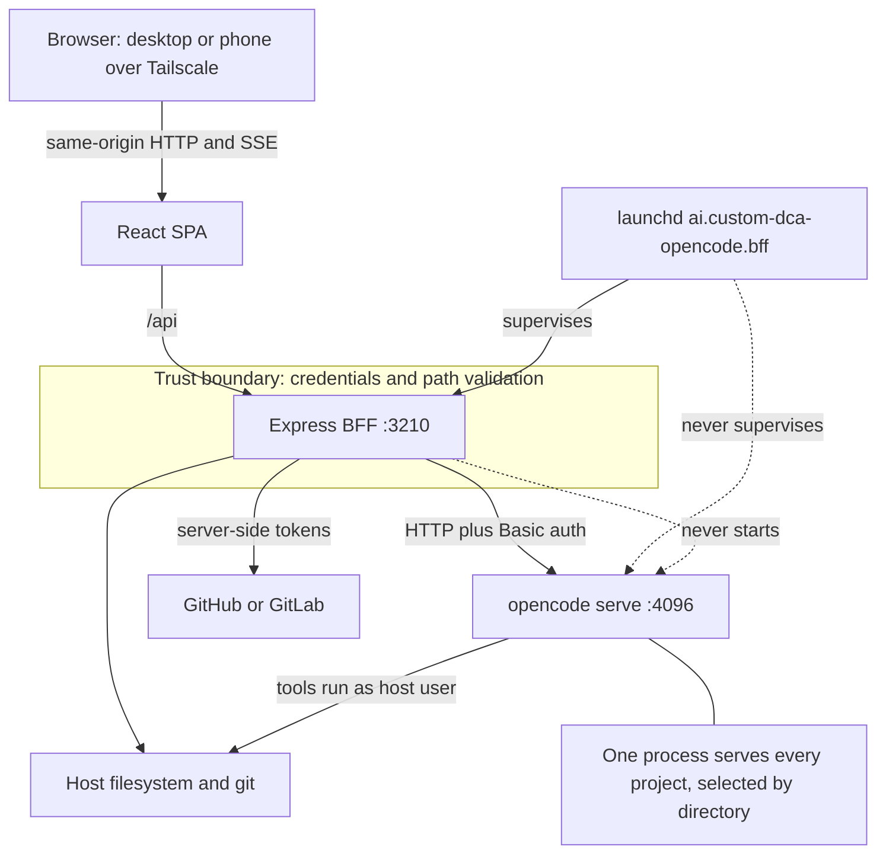
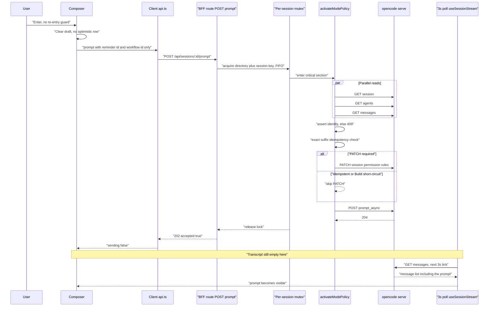
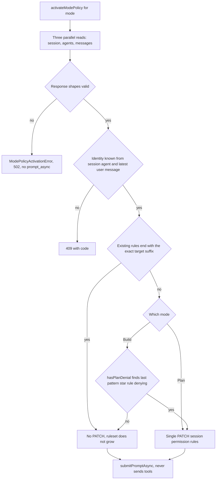
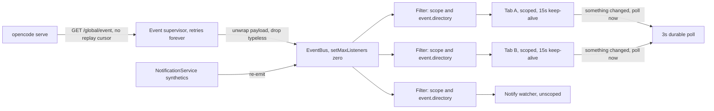
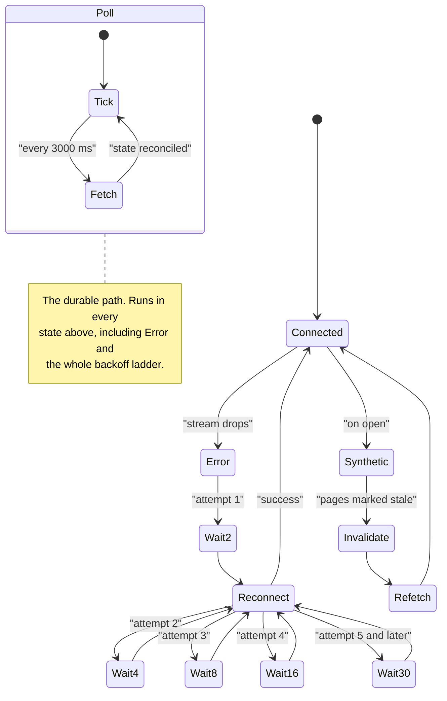

# Request and Event Architecture

| Field | Value |
|---|---|
| Snapshot date | 2026-08-26 |
| Status | `Snapshot — not maintained` |
| Repository commit | `39d6f48` |
| Records | How a browser request reaches OpenCode, how a prompt is submitted without blocking, and how one upstream event stream is fanned out to many browsers. |

> **This is a point-in-time snapshot.** It is deliberately not synchronized with the
> implementation and will drift as the code changes. `docs/architecture.md` and `AGENTS.md`
> remain the source of truth. Read this document for the reasoning captured on 2026-08-26,
> not for the current behaviour of the system.

## 1. Overview

A single long-lived OpenCode agent server runs on a developer workstation, and its only
first-party interface is a terminal UI. That interface is unreachable from a phone, holds no
credentials on the user's behalf, and exposes file routes that ignore agent permission rules.
This system places a React single-page application (SPA) and an Express backend for frontend
(BFF) in front of that server: the BFF owns credentials and path validation, converts the
blocking prompt call into an accepted-and-queued call, and multiplexes one upstream event
subscription out to every connected browser. This document records the three paths that carry
almost all traffic — the scoped request path, the asynchronous prompt path, and the global event
fan-out — together with the constraints of the upstream API that shaped each of them.

## 2. Background

OpenCode is an agent runtime distributed as a single binary. Started as `opencode serve`, it
exposes an HTTP API and a server-sent events (SSE) stream, holds sessions and their message
transcripts in its own storage, and executes agent tools — file reads, file writes, shell
commands — directly on the host as the user who launched it. It ships a terminal UI as its
primary client. There is no container, no separate agent sandbox, and no per-request
authentication beyond an optional HTTP Basic credential on the whole server.

One OpenCode process serves every project on the machine. Projects are not separate instances;
they are a parameter. Nearly every instance-scoped route takes `?directory=<absolute path>`, and
that query parameter is the entire project selector. In this document a **directory** means one
such absolute host filesystem path — a Git repository or a Git worktree — that both identifies a
project to OpenCode and is the working directory its agent tools operate in. A live instance was
observed serving 32 projects and 2,483 sessions.

A **BFF** is a server process that exists only to serve one specific client. It is not a
general-purpose API. This BFF terminates the browser's same-origin HTTP and SSE connections,
holds the OpenCode and forge credentials that the browser must never see, canonicalizes every
path the browser sends, adds capabilities OpenCode has no route for (local `git log`, GitHub and
GitLab context, notification delivery, a preview reverse proxy), and serves the built SPA in
production.

This is the successor to a container-based runner built on OpenHands, which is frozen. That
predecessor ran the agent runtime and a Postgres database inside Docker, and much of its
feature set existed to reach inside that container. Dropping the container dropped the need for
those features, and dropped the fixed-port constraint that had allowed only one running worktree
at a time.

## 3. Problem Statement

The agent server is already reachable and already useful from a terminal on the workstation. The
problem is everything that is not a terminal on the workstation.

From a phone there is no terminal pane, so the OpenCode terminal UI is not a degraded experience
but an absent one. That single fact is why a web client exists at all. Everything else the BFF
does is a consequence of putting a browser — specifically, a browser on a tailnet, which is a
network with more than one device on it — in front of a process that was designed for a local
terminal.

Four capabilities must be added, and each has a measurable size:

- **Credential isolation.** The OpenCode HTTP Basic credential, the GitHub token, and the forge
  tokens must never reach the browser. A browser that holds the OpenCode credential holds
  arbitrary host command execution.
- **Path validation.** OpenCode's file routes do not apply agent permission rules. A browser
  that can send an arbitrary absolute path to those routes can read every file the host user can
  read. Every browser-supplied path must therefore be canonicalized and contained before it
  reaches upstream.
- **Event fan-out.** The classic event stream is directory-scoped and single-subscriber in
  practice. A multi-project user interface with several tabs open needs one upstream
  subscription demultiplexed to many browser connections, not one upstream subscription per tab.
- **Recovery without a replay cursor.** The classic event stream emits no `id:` field and honours
  no `Last-Event-ID`. A dropped connection cannot be resumed; it can only be replaced, and the
  client must refetch whatever it missed.

The cost of building this is a second system to operate. It has its own supervisor entry, its own
port, its own failure modes, and its own persisted state, and it must stay in step with an
upstream whose published documentation understates its own surface: a live `GET /doc` returns
OpenAPI 3.1 describing 162 paths and 188 operations, against roughly 60 documented on the
website. Every contract in this document was read off a live server, not a docs page, and the
same will be true of every future change.

## 4. Tenets

1. **A durable poll beats a faithful stream.** A three-second poll that is always correct
   degrades to itself when the network fails, whereas a stream treated as the source of truth
   diverges silently the moment a frame is lost.
2. **The canonical path beats the caller's path.** Forwarding the string the browser sent
   reopens a validated hole, because a symlink can be swapped between the check and the use.
3. **Tolerating an unknown event beats validating it.** The upstream event union is larger than
   ours and grows on its own schedule, so rejecting what we do not recognize converts a server
   upgrade into a silent feature outage.
4. **One credential boundary beats browser convenience.** Every browser-facing call stays
   same-origin and unauthenticated-to-upstream, even when a direct call would be fewer hops,
   because a credential in a browser is a credential on a tailnet.
5. **Process-local honesty beats distributed coordination we cannot verify.** A mutex that
   admits it only covers this Node process is safer than one that implies a guarantee no second
   process or terminal UI would honour.
6. **One supervised process beats a better topology.** A single launchd-managed BFF beside an
   OpenCode server we do not start is worse on paper than an orchestrated stack, and materially
   easier to keep running on one workstation.

*Unless you know better ones.*

## 5. Goals

1. Make every OpenCode session on the host reachable and operable from a phone browser over a
   tailnet, with no terminal available.
2. Keep every credential — OpenCode, GitHub, GitLab, ntfy, Web Push — server-side, so the
   browser holds no secret and no direct route to the agent server.
3. Contain every browser-supplied filesystem path within configured roots before it reaches a
   route that would otherwise read arbitrary host files.
4. Submit prompts without holding an HTTP request open for the agent turn, so a phone that
   sleeps or a tab that closes cannot interrupt work already in progress.
5. Serve one upstream event subscription to an arbitrary number of browser tabs, and recover
   correctly after a disconnection despite the absence of a replay cursor.
6. Survive an upstream version bump without a code change for any event type, part type, or tool
   status we have never seen.

## 6. Scope

### In Scope

- The scoped request path from a browser URL through directory canonicalization to an upstream
  call.
- The asynchronous prompt path, including Plan and Build policy activation and the per-session
  serialization that guards it.
- The global event path: one upstream subscription, the in-process bus, browser SSE fan-out, and
  three layers of demultiplexing.
- The transcript adapter seam that keeps raw OpenCode message parts out of React components.
- Ownership and persistence of every piece of state the system holds, on the server and in the
  browser.
- Process topology and supervision, including what the BFF deliberately does not start.

### Out of Scope

Each exclusion below is deliberate, and the reason is that the capability either existed only to
reach inside the predecessor's container, or is already better served by a tool the user has
open.

- **Preview lifecycle controls** (start, stop, logs, status). These managed processes inside the
  container. Without a container the user starts a dev server in a terminal. The reverse proxy
  survives, because from a phone there is no terminal to read the URL from.
- **A terminal page and a web pseudo-terminal (PTY).** Both existed because the container's
  shell was otherwise unreachable. The host shell is reachable directly, and a read-only
  Commands panel derived from the transcript covers the review case without shipping remote
  command execution over a browser socket.
- **Provider and model settings pages.** Model and provider configuration lives in OpenCode's own
  configuration files, which have schema autocomplete. A second editor would be a second source
  of truth for the same values.
- **Manager runs.** These required the predecessor's Postgres database. Dropping the container
  dropped Postgres, and a cmux skill covers the workflow.
- **MCP and LSP latency probes.** `GET /mcp` already reports `failed{error}` and `needs_auth`,
  which is the diagnostic that mattered. A latency number would add a polling cost for
  information nobody acted on.
- **A permissions editor.** Permission matching is last-match-wins, so an editor that reorders
  rules can silently widen access. Authoring stays in `opencode.jsonc`, where the schema
  validates it, and this system displays the effective rules read-only.
- **Skills toggles and condenser settings.** OpenCode has no equivalent surface, so there is
  nothing to toggle against.

## 7. Requirements

### User Requirements

| ID | Priority | Requirement |
|---|---|---|
| U1 | **P0** | Open, read and continue any OpenCode session from a phone browser on the tailnet. |
| U2 | **P0** | Send a prompt and see it appear in the transcript without the browser staying connected for the turn. |
| U3 | **P0** | Select a project and have that selection survive a reload and a restart of the BFF. |
| U4 | **P0** | See a transcript that reflects the server's state after a network drop, without a manual refresh. |
| U5 | **P1** | Receive a notification when an agent needs an answer or a turn ends, on a device that is not in front of the machine. |
| U6 | **P1** | Read repository context — status, recent commits, file contents — without leaving the conversation. |
| U7 | **P1** | Know which policy, Plan or Build, produced any given message already on screen. |
| U8 | **P2** | Reach a locally running preview server from the phone without knowing its port. |

### Technical Requirements

| ID | Priority | Requirement |
|---|---|---|
| T1 | **P0** | No OpenCode, forge, ntfy or Web Push credential is ever sent to the browser; every browser-facing API is same-origin. |
| T2 | **P0** | Every browser-supplied path is canonicalized with `realpath` and contained beneath a configured root before any upstream or filesystem use; the canonical result, never the caller's string, is what is forwarded. |
| T3 | **P0** | No UI request may hold an HTTP connection open for the duration of an agent turn. |
| T4 | **P0** | Unknown event types, unknown message part types and unknown tool statuses must be forwarded or degraded, never rejected, and no reducer may throw on them. |
| T5 | **P0** | Transcript state refreshes on a 3-second poll while a session is open, and a reconnecting client refetches rather than resuming, because no replay cursor exists. |
| T6 | **P0** | Plan and Build policy activation and prompt submission are one critical section, serialized per directory and session. |
| T7 | **P1** | The browser SSE keep-alive interval is 15 seconds, independent of upstream's own 10-second heartbeat, so a fully filtered stream still proves liveness. |
| T8 | **P1** | Client SSE reconnection uses a capped 2, 4, 8, 16, 30-second backoff and closes the source itself rather than relying on browser-default retry. |
| T9 | **P1** | React components must not import OpenCode SDK types or read a raw message part; that mapping lives in exactly one module. |
| T10 | **P2** | Upstream version skew is reported, never fatal. |

## 8. Assumptions and Dependencies

### Assumptions

Each of the following is falsifiable, and the system's behaviour changes if it is false.

- Exactly one `opencode serve` process is running, and it is already running before the BFF
  starts. Falsified by a stopped server: every upstream call fails and the event supervisor
  retries forever.
- One user operates the system. There is no per-user identity anywhere, so a second person on
  the tailnet is the same principal.
- The tailnet is the security perimeter for reachability. Falsified by a hostile device on the
  tailnet, because the BFF has no authentication middleware.
- All projects live beneath the configured projects root or worktree root. Falsified by a
  project elsewhere: it is not reachable, by design.
- A browser tab is short-lived relative to a session. Falsified by a tab left open for days,
  which is why the keep-alive and the visibility gate exist.
- Agent turns outlive requests. Every prompt is queued, so a closed tab must not cancel work.

### Dependencies

| Dependency | Purpose | Limitation named |
|---|---|---|
| OpenCode 1.18.22 | Sessions, transcripts, agent execution, event stream | The classic event stream has no replay cursor: no `id:` is emitted and `Last-Event-ID` is not honoured. `/session/status` is process-local, so absence is not proof of idleness. `GET /find` silently caps at 10 results. `GET /file/status` and `GET /find/symbol` return `[]` unconditionally and are unusable. `Todo` has no `id`, so task rows are keyed by index and content. |
| Host filesystem | Project and worktree discovery, file reads, path canonicalization | Discovery is a bounded walk, not an index; symlinks must be resolved rather than trusted. |
| Git (host binary) | Status, recent commits, ignore checks | Shelled out per call, because no upstream route exists for commit history. |
| Tailscale | Reachability from a phone | Provides network reachability only. It is not authentication, and the BFF adds none. |
| launchd | Supervision of the BFF | Supervises the BFF only. It does not supervise OpenCode, and this system never starts or stops OpenCode. |

## 9. Proposed Design

### Process topology

Three processes run, none containerised: the browser, the Express BFF, and `opencode serve`.

`opencode serve` is **not started by this application**. `deploy/README.md:137` states it
directly: "The BFF never starts OpenCode. It connects to the one server named by `OPENCODE_URL`
in `.env`." The default upstream port is 4096 (`server/opencode/client.ts:50`). One OpenCode
process serves every project, selected per request by `directory`.

The Express BFF terminates all browser traffic and, in production, also serves the built SPA.
Its launchd label is `ai.custom-dca-opencode.bff` (`scripts/launchd.ts:7`) and its supervised
port is 3210 (`scripts/launchd.ts:8`), while the development default is 3000
(`server/index.ts:46`). It binds `0.0.0.0` (`server/index.ts:135-137`) so that a phone on the
tailnet can reach it. Two guards protect installation: `scripts/launchd.ts:73-75` refuses to
install a supervised service on port 3000, keeping the development port free, and
`scripts/launchd.ts:112-118` refuses to install at all if the target port already has a listener.

In development a Vite dev server runs on 5173 and proxies only `/api` to the BFF
(`vite.config.ts:58-60`). In production the BFF serves `express.static` plus a SPA fallback
matching `/^\/(?!api\/).*/`, registered **after** every `/api` router
(`server/index.ts:125-133`); that ordering is what stops the fallback from swallowing unmatched
API routes.

The generated plist runs the service as `gui/${process.getuid()}` with program
`[process.execPath, dist/server/index.js]` and no shell, sets `WorkingDirectory` to the
repository root — which is how `dotenv.config()` at `server/index.ts:43` finds `.env` — and
passes an environment of only `HOME`, `PATH`, `NODE_ENV` and `PORT`. There are **no credentials
in the plist** (`deploy/README.md:127-133`); secrets stay in `.env`, read at boot from the
working directory. Uninstall is correspondingly narrow: it never runs `pkill` and never touches
OpenCode (`scripts/launchd.ts:213-220`).

Boot order in `server/index.ts` is fixed, and the middleware list is short enough to state in
full: `dotenv.config()` at `:43`; `express.json({limit:"20mb"})` at `:50`, which is **the only
middleware registered before routes**; the EventBus at `:53`; the AutoPermissionService at
`:57-58`; the notification stores at `:59-61`; `webPushConfig()` at `:62`, which throws at boot
on a partially configured VAPID key pair rather than silently disabling push; the
NotificationService at `:63-73`; `bus.start()` at `:74`; 15 routers at `:76-91`; the health route
at `:98`; and static serving at `:127`.

What is **verified absent** from that list matters as much as what is present. There is no CORS
middleware and no `Access-Control-*` header anywhere in the server. There is no `helmet`, no
request logger, no rate limiter, and **no authentication middleware**. Every browser-facing route
is reachable by anything that can reach the port, which is the direct consequence of treating the
tailnet as the perimeter.

### The directory-scoping contract

A project selection begins as a string in the browser and must become a canonical host path
before it is used. The chain is short and every link is load-bearing.

The selection is read from the URL and `localStorage` at `client/pages/Hub.tsx:159` and persisted
at `client/pages/Hub.tsx:193-195`. Every client call attaches it through `scoped()`
(`client/lib/api.ts:447-451`). On the server, `directoryOf(req)`
(`server/routes/sessions.ts:62-66`) reads it, with the query parameter winning over the body.
`requireWorkspaceDirectory` then canonicalizes it, and the **canonical** result — never the
browser's string — is what reaches upstream, injected into the query at
`server/opencode/client.ts:122`.

`server/paths.ts` is the whole validation surface. It exports `PathError` (`:9-17`),
`projectsRoot` (`:25-27`), `worktreesRoot` (`:29-33`), `requireProjectDirectory` (`:42-72`),
`requireWorkspaceDirectory` (`:74-83`), `requireRelativePath` (`:86-96`),
`isSensitiveWorkspacePath` (`:98-102`) and `requireReadableWorkspacePath` (`:105-147`).
`requireWorkspaceDirectory` tries the projects root first and retries the worktree root **on 403
only**, so a genuine 400 is not masked by a second attempt.
`isSensitiveWorkspacePath` denies `.git`, `.env*`, `.ssh`, `.aws`, `credentials`, `id_rsa` and
`id_ed25519`.

The validation order inside `requireProjectDirectory` is fixed, and each step has its own status
code: non-empty string (400), absolute (400), `realpath` on both the candidate and the root, with
a throw becoming 400, `isDirectory()` (400), not the root itself (403), containment beneath the
root (403), and finally return the canonical path. The rationale is recorded at
`server/paths.ts:35-41`: OpenCode's file routes do not apply agent permission rules, so checking
only for an absolute path would expose every readable host file to a browser on the tailnet, and
`realpath` also closes symlink escapes from the projects root.

The canonical-path rule at `server/paths.ts:144-146` extends that reasoning to relative targets:
callers must forward the canonical relative target, never the original symlink alias, because the
link could be swapped after validation and before use. It is honoured at
`server/routes/workspace.ts:26-27,37-38` and `server/opencode/workspace.ts:166-177`.

`requireReadableWorkspacePath` adds one more gate beyond containment and sensitivity: it runs
`git check-ignore -q` with a 5-second timeout (`server/paths.ts:135`). Exit code 0 means the path
is ignored and produces a 403; exit codes 1 and 128 pass, so a non-repository directory does not
become unreadable.

| Input | Status |
|---|---|
| Missing directory | 400 |
| Relative path | 400 |
| Nonexistent path | 400 |
| Path is a file | 400 |
| Path equals a configured root | 403 |
| Path outside both roots | 403 |
| Projects root itself unreadable | 500 (`server/projects.ts:55`) |

Two routes are **deliberate exceptions** to this contract.

`GET /api/events` does not validate the directory at all (`server/routes/sessions.ts:730-731`).
The directory there is a pure string-equality filter (`server/routes/sessions.ts:743`) that can
only narrow a stream which has already been fanned out; it grants no access and reaches no
filesystem. The accepted cost is stated plainly: an unnormalised path silently matches nothing,
producing a connection that receives only unscoped events and never an error.

`GET /api/recent-sessions` drops invalid directories rather than rejecting the request
(`server/routes/recents.ts:96-100`), because its candidate set comes from `localStorage`, which
outlives project renames and travels between machines. Rejecting the whole request would blank a
panel that is mostly about other, still-valid projects.

Project discovery is bounded by **two** caps plus a depth limit:
`PROJECT_SCAN_MAX_RESULTS = 500`, `PROJECT_SCAN_MAX_DIRECTORIES = 5_000`, and
`PROJECT_SCAN_MAX_DEPTH = 5` (`server/projects.ts:6-9`). `AGENTS.md` decision 12 conflates the
first two, describing discovery as "capped at 500 directories"; the 500 is a cap on results
returned, while 5,000 is the cap on directories visited during the walk.

### The typed fetch seam

Every upstream call passes through one module, and the reason is recorded in that module.
`server/opencode/client.ts:29-34` states that `@opencode-ai/sdk` is deliberately not used: its
bundled v1 query types are narrower than the live server — `session.list` accepts only
`directory` in the SDK, while the server also takes `limit`, `roots`, `search`, `start` and
`scope` — and its event names are stale. Depending on it would mean casting around it constantly,
which defeats the purpose of types. The application owns a thin typed layer over `fetch` instead
and treats the live `GET /doc` as the contract. The SDK is not in `package.json`.

`requestWithResponse<T>` (`server/opencode/client.ts:116-146`) is the entire seam. It builds the
URL, injects the directory at `:122` before the generic query loop so a caller cannot omit it by
accident, sets `Accept: application/json`, adds the HTTP Basic credential through
`basicAuthHeader` (`:57-61`), raises exactly one error type — `OpencodeError(status, path, body)`
(`:84-93`), which truncates the upstream body to 300 characters — and handles 204 explicitly at
`:142-143`, because 204 is the success status for `prompt_async` and would otherwise fail JSON
parsing.

`EXPECTED_SERVER_VERSION = "1.18.22"` (`server/opencode/client.ts:37`) is asserted advisorily
only: version skew is reported and never fatal (`server/opencode/client.ts:163-167`,
`server/index.ts:101-111`). `eventStreamUrl` (`:74-81`) places the Basic credential in an
`?auth_token=` query parameter rather than a header, because `EventSource` cannot set headers.

**No timeouts and no retries exist at this layer.** The only `AbortSignal` that ever reaches it
belongs to `getSessionMetadata` (`server/opencode/sessions.ts:389,393`), used solely by the
notification service with a 2-second timeout. Every other call, including the entire prompt path,
can hang for as long as Node's `fetch` holds the socket open. This is a design gap, not a
simplification, and it is carried forward into the risk register: a wedged upstream connection
becomes a wedged browser request with no ceiling.

The application calls 30 distinct upstream paths and touches nothing under `/api/**`, the newer
event-sourced v2 surface. Where no upstream route exists, work is done locally: `git log` is
shelled out at `server/opencode/workspace.ts:226-233`.

Error mapping happens once, at `server/routes/sessions.ts:233-245`. An upstream 4xx passes
through unchanged. An upstream 5xx becomes **404** when the caller sets `notFoundOn5xx`, because
OpenCode answers 500 `UnknownError` for an unknown session id rather than 404
(`server/routes/sessions.ts:186-190`); otherwise a 5xx becomes **502**.

### The prompt path

The composer lives at `client/pages/Conversation.tsx:475-514` and is gated on
`canPrompt = agentIdentityKnown || foreignReady` (`:472-473`), with Send disabled when
`!canPrompt || sending || !draft.trim()` (`:990`).

**There is no optimistic transcript row.** `stream.refresh()` at
`client/pages/Conversation.tsx:502` is the only mechanism by which a prompt becomes visible, and
it becomes visible only on the next successful `GET /api/sessions/:id/messages`. The draft is
cleared before the transcript shows the message, so a failure between acceptance and the next
poll leaves a visually empty conversation for up to three seconds. That is an accepted cost: the
alternative is a speculative row that can contradict the durable poll, which tenet 1 rejects.

The Enter-to-send guard is reasoned at `client/pages/Conversation.tsx:530-531`: `send()` has no
re-entry guard and `prompt_async` returns as soon as the turn is queued, so a fast double Enter
would post two turns.

Only the reminder and workflow **id** cross the wire (`client/lib/api.ts:554-577`). Bodies are
resolved server-side, so a tampered browser can never author sentinel content that the server
would treat as trusted injected text.

The BFF route is `server/routes/sessions.ts:461-506`. `promptAgent` rejects the values `plan` and
`build` outright with the message "prompt Plan or Build through 'mode', which activates session
policy" (`server/opencode/sessions.ts:141-150`), because naming a mode as an agent would bypass
policy activation. The route responds **202** `{accepted:true}` (`server/routes/sessions.ts:504`).
The distinction matters: **the BFF returns 202 while 204 is the upstream `prompt_async` status.**
`docs/architecture.md:29` says the BFF "returns immediately", which is true of the agent turn but
not of the request — the request performs seven upstream calls before it answers.

`prompt` (`server/opencode/sessions.ts:858-868`) wraps policy activation and submission together
in `withSessionPromptLock`.

`activateModePolicy` (`server/opencode/sessions.ts:410-447`) is the policy step, in order: three
parallel upstream reads (`:417-424`); shape guards on the responses (`:425-428`);
`assertModeAgentIdentity` (`:429`), where the driving agents are the session agent and the latest
**user** message's agent, with assistant agents explicitly excluded from identity because of
`compaction` (`:196-206`); an **exact-suffix idempotency check** (`:431`) via `rulesEndWith`
(`:150-158`), which compares the last N rules field by field and is what stops repeated
same-mode prompts from growing the ruleset; a **Build short-circuit** (`:432-436`) that skips the
PATCH entirely unless `hasPlanDenial` (`:177-188`) finds a real Plan denial by scanning backwards
for the last rule with `pattern === "*"`, honouring last-match-wins; and otherwise exactly one
`PATCH /session/{id}` (`:438-442`).

Failure modes are distinct. An activation failure raises `ModePolicyActivationError` and returns
**502**, and `prompt_async` is never reached — a prompt is never submitted under an unverified
policy. An identity failure returns **409** with a code, because it is a client-correctable
disagreement rather than an upstream fault.

`PLAN_TOOL_ALLOWLIST` (`server/opencode/sessions.ts:32-42`) is `read`, `glob`, `grep`,
`webfetch`, `websearch`, `question`, `task`, `todowrite`, `skill`. `task` is in the allowlist, so
Plan appends no `task` rule and safe read-only delegation survives Plan mode.

`submitPromptAsync` (`server/opencode/sessions.ts:820-849`) is the single `prompt_async` call
site, and it **never sends a `tools` field**. Non-empty legacy `tools` entries persist on the
session as permission rules, so enforcing Plan through `tools` would leave write access denied
after a later Build prompt omitted the field.

The lock (`server/opencode/sessions.ts:104`, `:215-234`) is a promise-chain mutex keyed
`${directory}\0${sessionID}`, first-in-first-out (FIFO), with `previous.catch(() => undefined)`
applied twice so a rejected predecessor cannot poison the queue. It is held across the activation
reads, the PATCH and `prompt_async`. It is a module-level `Map`, and therefore **per Node
process**: a second BFF process, or a terminal UI prompting the same session, has no visibility
into it. That is the honest boundary behind the phrase "serialize process-locally", and tenet 5
is the reason it is stated rather than obscured.

`POST /session/{id}/message` is genuinely never used; the only `/message` occurrences under
`server/` are GETs. `server/opencode/sessions.ts:6-8` records why: it holds the HTTP response
open for the entire agent turn, which looks like a hang from a user interface and dies the moment
a client disconnects. Regression coverage at `tests/session-mode-policy.test.ts:47-50` asserts
that the mutation set for a prompt is exactly `{PATCH, prompt_async}`.

**One prompt costs seven upstream requests** at minimum, eight when the PATCH is required, and
nine or ten on a cold 15-second model cache:

1. Read the session.
2. Read the resolved agent list.
3. Read the latest messages, for user-message agent identity.
4. Read the effective permission policy.
5. Read the model catalogue, when the 15-second cache is cold.
6. Read capabilities, when the 30-second cache is cold.
7. `PATCH /session/{id}`, only when activation is not already idempotent and not short-circuited.
8. `POST /session/{id}/prompt_async`.

None of these has a timeout.

### The event path

One upstream subscription is created at boot (`server/index.ts:53`, started at `:74`), before any
route is reachable and independent of whether a browser is connected.

The supervisor loop is `server/opencode/events.ts:66-94`. Backoff runs from 1,000 ms to 30,000 ms
(`:39-40`), doubling at `:92`, resetting on a clean stream end at `:83` and on a successful
connect at `:107`, and retrying **forever**. `connect()` (`:96-127`) uses plain `fetch` with
`Accept: text/event-stream` and hand-parses frames on `\n\n` with a streaming `TextDecoder`;
there is no `EventSource` polyfill on the server, and **no `Last-Event-ID`** is ever sent.
`handleFrame` (`:129-153`) parses inside a `try` that returns silently on malformed input,
unwraps `envelope.payload ?? envelope` so that both the `/global/event` envelope shape and bare
`/event` frames work, and drops frames with no `type`. `setMaxListeners(0)` at `:59` exists
because many tabs attach listeners to the same bus.

Browser fan-out is `server/routes/sessions.ts:730-761`. The response sets
`text/event-stream`, `no-cache, no-transform`, `keep-alive` and `X-Accel-Buffering: no`, then
writes a synthetic `connected` frame first. One `bus.on("event")` closure is registered per
connection and removed on `req.on("close")` along with the keep-alive timer. A 15-second
`: keep-alive` comment (`:755`) is sent deliberately independent of upstream's own 10-second
`server.heartbeat`, because the BFF may be filtering all upstream traffic out for this
subscriber (`:753-754`). No `retry:` field is ever sent, so browsers use their own default.

**Backpressure is not handled.** The return value of `res.write` is discarded at `:749` and
`:755`, and there is no `drain` listener, no queue cap and no slow-client eviction. A stalled TCP
peer accumulates frames in Node's socket write buffer for as long as it stays connected. This is
carried forward as a risk.

The bus is not upstream-only. The notification service re-emits into it
(`server/notifications/service.ts:416-420`, `:535-539`), so `/api/events` carries a union of
upstream OpenCode events and BFF-synthetic events.

Demultiplexing happens in three layers.

The first is the BFF filter at `server/routes/sessions.ts:743`, written as
`if (scope && event.directory && event.directory !== scope)`. An event with **no** directory is
therefore forwarded to every scoped subscriber, which is exactly what lets BFF synthetics through
and is why the client filters again. The second is the client's own scope check plus a session-id
refilter (`client/lib/useSessionStream.ts:225`, `:248-249`). The third is deliberate absence:
`useNotifyWatcher` subscribes unscoped (`client/lib/useNotifyWatcher.ts:85`) because
notifications are cross-project.

Unknown event types are tolerated at every layer. `server/opencode/events.ts:157-159` states the
reason: filtering there would mean a server upgrade silently breaks a feature. On the client the
entire handler body sits inside a `try/catch` (`client/lib/useSessionStream.ts:274-276`),
`server.heartbeat` is explicitly dropped (`:246`), and unknown types fall through to a harmless
poll (`:273`). The adapter drops unknown `Part.type` values and treats an unknown tool status as
`running` rather than discarding the tool entirely (`client/lib/events.ts:366-378`, `:517-521`).
No reducer throws.

The hook header at `client/lib/useSessionStream.ts:1-17` states the contract: two channels
deliberately, a 3-second poll that is the durable source of truth and an SSE subscription that
only says "something changed, poll now". The stream never carries transcript content, so if it
drops the UI degrades to exactly its pre-SSE behaviour instead of showing a divergent view.
Because browsers cap HTTP/1.1 at roughly six connections per origin, the stream opens only when
the tab is visible (`:224`). Backoff is 2, 4, 8, 16, 30 seconds (`:40-42`). `onerror` closes the
source itself (`:278-283`), because the browser's built-in infinite retry turned a server restart
into a pool-exhausting storm in the predecessor (`:12-15`). The retry counter resets on a valid
application frame rather than a TCP open (`:231-233`), on visibility change (`:288`), and on a
`window online` event (`:295-300`).

Refetch-on-reconnect is `client/lib/useSessionStream.ts:234-245`: the synthetic `connected` frame
hard-invalidates every backfilled page, bumps the history generation and resets cursors. There is
no replay cursor anywhere in the system — `Last-Event-ID` is never sent, and the BFF never emits
an `id:` field — so replacing state is the only correct recovery.

One divergence is worth reporting rather than hiding. The second `EventSource`, in
`useNotifyWatcher` (`client/lib/useNotifyWatcher.ts:85`), has **no `onerror`, no backoff, and no
visibility gating**. It relies on browser-default infinite retry, which is precisely the
behaviour `client/lib/useSessionStream.ts:12-15` records as a past outage, and it never closes on
tab hide, so a background tab holds a connection open indefinitely.

### The transcript adapter seam

`client/lib/transcript.ts` is labelled the frozen contract at `:3`, with the rule at `:6-7` that
no React component may import OpenCode SDK types or touch a raw `Part`. The event union at
`:155-162` is `UserEvent | AgentEvent | ThoughtEvent | ToolEvent | PatchEvent | StatusEvent |
ErrorEvent`. `UsageSnapshot` and `InterruptedState` are deliberately out-of-band values rather
than rows, because neither belongs at a position in the transcript. `MessageMode` is re-declared
at `:35` rather than imported, because importing it would place a backend-aware module on the
frozen contract's import graph (`:26-34`).

Mapping is one switch, at `client/lib/events.ts:382-522`. A `file` part maps to `null` and is
folded into the adjacent turn as an attachment rather than becoming a row of its own. A
turn-level `info.error` appends an extra error event **after** the parts, which preserves both
the partial work and the failure (`:589-601`). Patch metadata is bounded to 8 files, 240 path
characters and 1,200 aggregate characters, with `filesTruncated` reported honestly (`:91-95`).

Hand-back detection (`client/lib/events.ts:292-310`) requires all three of a `ses_` session id, a
delegation word and an outcome word, and tests failure first so that "failed to complete" is not
read as success. A spurious success is the expensive direction to be wrong in.

Reconciliation has two layers. Page-level identity is `message:<info.id>`, then `parts:<ids>`,
then `unknown:<JSON>` (`client/lib/messagePages.ts:11-17`), and a response with
`nextCursor === null` is treated as authoritative, clearing stale rows (`:41-60`). Event-level
fingerprints (`client/lib/derive.ts:25-42`) **include mode for both prose kinds**; the reason is
recorded at `:21-23`: a first sight of a message can lack the metadata that classifies it, and
without mode in the fingerprint a later authoritative fetch would leave the row rendering neutral
forever. `mergeEvents` (`:50-76`) returns the same array reference when nothing changed, so memo
boundaries survive a poll.

Mode provenance is `client/lib/events.ts:328-364`, and its precedence is exact. A user message is
classified solely from an exactly recognised `info.agent`, and `info.mode` is deliberately not
consulted. An assistant turn prefers `info.mode` with `info.agent` as fallback, so a recognised
mode classifies the row even when the naming agent is internal or a sub-agent. Two recognised
values that disagree yield nothing. An unrecognised `info.mode` is an unknown label, is not
disqualifying, and falls through to the identity. Nothing is inherited from a neighbour, a
parent, or the session. Only user and assistant prose carries the treatment. The docstring at
`:347-349` notes that the live fixture only ever pairs `info.mode` with an agreeing `info.agent`,
so this ordering is a forward-compatibility choice rather than an observed behaviour. The pill is
provenance and not a policy guarantee: a child session can report Build while still carrying a
parent's historical Plan denies, so a Build pill never proves the turn could mutate anything.

### State ownership

| State | Owner | Persistence |
|---|---|---|
| Sessions, messages, todos, sharing | OpenCode | OpenCode storage |
| Notification history and resolution | BFF | `.state/notification-history.json` |
| Auto-permissions toggle | BFF | Memory only; defaults off after restart (`server/opencode/autoPermissions.ts:20`, `:77`) |
| Git worktrees and repository state | Host | Local filesystem and Git |
| Global event subscriptions | BFF | Process lifetime |
| Sub-agent state | BFF | Derived per request; never stored |

`docs/architecture.md:92-100` is correct but incomplete. The rows it omits are these:

| State | Owner | Persistence |
|---|---|---|
| Project pins | BFF | `.state/project-pins.json` (`server/projects.ts:156`), file mode 0600, directory 0700 |
| Model pins | BFF | Persisted, capped at 20 |
| Notification preferences | BFF | Persisted |
| Web Push subscriptions | BFF | Persisted, capped at 32, file mode 0600 |
| Instruction audit | BFF | Persisted, capped at 500 records |
| Managed-child launch idempotency map | BFF | Memory, capped at 500 (`server/opencode/sessions.ts:956-957`) |
| Prompt mutex map | BFF | Memory, per Node process |
| Model catalogue cache | BFF | Memory, 15-second time to live (TTL) |
| Capability cache | BFF | Memory, 30-second TTL |
| Planning caches | BFF | Memory, 60-second and 5-minute TTLs |

Browser-owned state is entirely in `localStorage`; `sessionStorage` is used nowhere.

| Key | Contents |
|---|---|
| `opencode.directory.v1` | Selected project directory (`client/lib/palette.ts:3`) |
| `opencode.recentSessions.v1` | Recent session list, capped at 50 |
| `opencode.wrapOutput.v1` | Output wrapping preference |
| `opencode.planning.view` | Planning view selection |
| `opencode.planning.density` | Planning row density |
| `opencode-notification-media-v1` | Device-local notification sound and speech settings |
| `opencode-notification-view-v1` | Notification inbox filters |
| `theme` | Light or dark selection |

Two inconsistencies are worth recording. `opencode.directory.v1` is exported as a constant from
`client/lib/palette.ts:3` but duplicated as a bare string literal in `client/pages/Hub.tsx:36`
and `client/pages/Tools.tsx:8` rather than imported, so a rename would need three edits. And the
key names mix dot-versioned (`opencode.directory.v1`) with hyphen-versioned
(`opencode-notification-media-v1`) conventions, with `theme` unversioned entirely.

## 10. Alternatives Considered

| Alternative | Mobile browser | Settings UI | Credentials server-side | Processes to supervise | Verdict |
|---|---|---|---|---|---|
| Do nothing — OpenCode terminal UI in cmux | No | N/A | Yes | 0 | Rejected |
| Plugins plus a cmux composition | No | No | Yes | 0 | Rejected |
| Adopt OpenChamber | Partial | Yes | Yes | Unknown | Rejected |
| Containerize with Docker | Yes | Yes | Yes | 3+ | Rejected |
| Build on `@opencode-ai/sdk` | Yes | Yes | Yes | 1 | Rejected |
| Build on the `/api/**` v2 surface | Yes | Yes | Yes | 1 | Rejected, revisitable |
| Per-directory `GET /event` subscriptions | Yes | Yes | Yes | 1 | Rejected |
| Blocking `POST /session/{id}/message` | Yes | Yes | Yes | 1 | Rejected |
| Enforce Plan with the legacy `tools` field | Yes | Yes | Yes | 1 | Rejected |
| Server-sent events only, no polling | Yes | Yes | Yes | 1 | Rejected |
| WebSocket instead of server-sent events | Yes | Yes | Yes | 1 | Rejected |
| **Custom SPA over a BFF on the classic API** | **Yes** | **Yes** | **Yes** | **1** | **Chosen** |

**Do nothing — keep using the OpenCode terminal UI in cmux.**

**Pros.** Zero code, zero maintenance, zero new attack surface, and the terminal UI is
maintained upstream by people who know the server better than we do.

**Cons.** It requires a terminal emulator and a keyboard. From a phone there is no cmux pane to
attach to, no way to answer a permission prompt, and no way to read a transcript that scrolls
faster than a thumb.

**Rejected because.** It fails Goal 1 outright — "reachable and operable from a phone browser
over a tailnet, with no terminal available" — and therefore fails the mobile-first commitment
recorded as `AGENTS.md` decision 7. That requirement is also the reason the preview reverse
proxy survived descoping while preview lifecycle management did not: from a phone there is no
cmux pane to fall back on, so the proxy is the only way to see a running dev server.

**What would change our mind.** A first-class mobile client from upstream, or a phone-shaped
terminal experience good enough to answer a permission ask one-handed.

**A plugins-plus-cmux composition.**

**Pros.** No server to write and no second process. OpenCode's plugin surface can already
observe events and inject behaviour, and cmux can already render sidebars beside a session.

**Cons.** cmux sidebars cannot render input controls. A sidebar can display state but cannot
host a text field, a toggle, or a submit button, which makes a settings page impossible and a
composer impossible.

**Rejected because.** It cannot satisfy the In Scope settings and composer surfaces at all, and
it inherits the same terminal dependency that fails Goal 1.

**What would change our mind.** Interactive controls in cmux sidebar extensions.

**Adopting OpenChamber.**

**Pros.** An existing project aimed at roughly this problem, so the work would be adoption and
contribution rather than construction.

**Cons.** It does not match the state ownership and directory-scoping model this host needs, and
adopting it would mean inheriting its trust model rather than authoring the one recorded in
section 11.

**Rejected because.** It was evaluated against the tenets and goals above and declined; the
evaluation is recorded under `docs/research/`, and `AGENTS.md` decision 1 names it as the
considered-and-declined option alongside the plugins composition.

**What would change our mind.** Convergence of its data model with the directory-scoped,
credential-server-side model described in section 9, at which point the maintenance argument
would dominate.

**Docker.**

**Cons.** Three processes to supervise instead of one, a fixed-port constraint, and an image to
rebuild on every dependency change.

**Rejected because.** The container existed in the predecessor to host `agent-canvas` as the
agent runtime and Postgres for manager runs. Manager runs are out of scope, so Postgres goes
with them, and `opencode serve` is a single Bun binary that needs no runtime of its own. What
remains is one process to supervise, which is Tenet 6. Removing the container also removed the
fixed-port constraint that limited the predecessor to exactly one running worktree at a time.

State plainly what the container was buying: a real isolation boundary. A compromised or
mistaken agent could delete files inside the image and not outside it. That boundary is now
replaced by permission policy in `opencode.json` plus the honest observation recorded in
`AGENTS.md` decision 3 — OpenCode terminal sessions already ran host-side on this machine, some
with `--auto`. The change makes an existing posture deliberate rather than introducing a new
risk, but it is a downgrade in isolation and should be read as one.

**What would change our mind.** A second user on the host, or an agent configuration permitted
to run unreviewed code from the network.

**Using `@opencode-ai/sdk`.**

**Pros.** A maintained client, generated types, and no hand-written fetch layer.

**Cons.** The bundled v1 query types are narrower than the live server. `server/opencode/client.ts:29-34`
records the concrete case: `session.list` accepts only `directory` in the SDK while the live
server also takes `limit`, `roots`, `search`, `start` and `scope`. The event names are stale.
Depending on it means casting around it constantly, which defeats the purpose of having types at
all.

**Rejected because.** It fails Technical Requirement of treating the live `GET /doc` as the
contract, and it fails Tenet 3 by encoding an event union that is already smaller than the one
the server emits.

**What would change our mind.** An SDK generated from the live `GET /doc` at the pinned server
version, with an open event union.

**The `/api/**` v2 event-sourced surface.** — **two-way door**

**Pros.** Event-sourced, newer, and offers replayable per-session streams via
`/api/session/{id}/event?after=`, which is exactly the replay cursor the classic surface lacks.

**Cons.** It is contractually 401-gated and still moving, so building on it means authoring an
authentication path and absorbing breakage on every server bump.

**Rejected because.** Everything this application needs exists on the classic surface, so
adopting v2 would add a credential exchange and a moving contract for no capability currently in
scope. This is `AGENTS.md` decision 6.

**What would change our mind.** `/api/session/{id}/event?after=` becoming stable and usable. A
replay cursor would close the single largest correctness gap in section 9's event path and would
let the poll interval lengthen rather than remain the durable path. This is deliberately a
two-way door: the fetch seam localizes the base path, so migrating one route family at a time is
possible.

**Per-directory `GET /event` subscriptions instead of one `/global/event`.**

**Pros.** Each subscription carries only the traffic for one project, so no demultiplexing is
needed and a single project's noise cannot affect another.

**Cons.** N open projects means N upstream streams, each with its own reconnect state, backoff
ladder and failure mode. With 32 projects discovered on this host, that is up to 32 concurrent
upstream subscriptions to keep healthy for a single browser tab.

**Rejected because.** It fails Goal 5 — one upstream event subscription serving an arbitrary
number of browser tabs — and multiplies the reconnect surface that Tenet 1 exists to bound.

**What would change our mind.** An upstream global stream that dropped the `directory` field,
which would make demultiplexing impossible.

**The blocking `POST /session/{id}/message`.**

**Pros.** One call, and the response carries the completed turn, so no polling is needed to know
the result.

**Cons.** `server/opencode/sessions.ts:6-8` records the reasoning: it holds the response open for
the entire agent turn, and it dies when a client disconnects. A phone that sleeps mid-turn
cancels the request.

**Rejected because.** It fails Goal 4 directly — submit prompts without holding an HTTP request
open for the agent turn — and would make mobile use unreliable by construction.

**What would change our mind.** Nothing; `prompt_async` already covers the use case and returns
204.

**Enforcing Plan with the legacy `tools` field.**

**Pros.** A single field on the prompt call, with no session mutation and no policy computation.

**Cons.** Issue #15 established that non-empty `tools` overrides are converted into persistent
session permission rules. Omitting `tools` on the next Build prompt therefore does not restore
write access, because the denies from the previous Plan prompt survive on the session.

**Rejected because.** It fails the mode-switch requirement: Plan then Build then Plan must leave
the session in the mode named by the most recent prompt. `AGENTS.md` decision 9 records the
replacement — append-only session permission rules activated before each prompt, with exact
suffix comparison for idempotence.

**What would change our mind.** Upstream making `tools` per-request and non-persistent.

**Server-sent events only, with no polling.**

**Pros.** Lower request volume, lower latency, and no redundant fetches of state the stream
already delivered.

**Cons.** The classic stream has no replay cursor. A frame dropped during a reconnect gap is
lost permanently, and nothing in the protocol reveals that it happened, so the client's view
diverges silently and stays diverged.

**Rejected because.** It fails Tenet 1 — a durable poll beats a faithful stream — and Goal 5's
requirement to recover correctly after a disconnection despite the absence of a replay cursor.

**What would change our mind.** A replay cursor. See the v2 entry above.

**WebSocket instead of server-sent events.**

**Pros.** Bidirectional, framed, and widely supported.

**Cons.** It adds a protocol upgrade, a heartbeat scheme and a reconnect implementation the
application would own, in exchange for a client-to-server channel that has no use here.

**Rejected because.** Unidirectional server push is the entire requirement; every
browser-to-server action is already an ordinary request. Server-sent events reconnect natively,
so the browser supplies for free the behaviour a WebSocket would require us to write.

**What would change our mind.** A requirement for low-latency client-to-server streaming, such
as collaborative editing.

Two door annotations close this section. The classic-API choice is a **two-way door**: the fetch
seam is the only place the base path appears, and migration can proceed one route family at a
time. The frozen `TranscriptEvent` contract is a **one-way door** in practice: every row
component in the transcript depends on it, so changing its shape is a renderer-wide rewrite
rather than an adapter change. That asymmetry is the point of the seam — `client/lib/events.ts`
absorbs upstream churn precisely so the contract downstream of it does not have to move.

## 11. Security and Threat Model

### What are we working on

A single Node process that holds every credential in the system and exposes an unauthenticated
`/api` surface on `0.0.0.0`, in front of an agent server with host-level authority. The assets
worth protecting are the credentials, the host filesystem, and the ability to make an agent act.

Every credential is server-side only, and each has exactly one use site.

| Credential | Sole use |
|---|---|
| `OPENCODE_SERVER_PASSWORD` | Upstream authentication in the fetch seam (`server/opencode/client.ts:57-61`, `:74-81`) |
| `NTFY_TOKEN` | ntfy delivery |
| `GITHUB_TOKEN` | Forge and planning calls |
| `GITLAB_TOKEN` | Forge calls |
| `VAPID_PRIVATE_KEY` | Web Push signing |

The absence of leakage is structural rather than incidental. `/api/notifications` reports a
`tokenConfigured` boolean and the **public** VAPID key, never the token or the private key.
`/api/health` returns `opencode.baseUrl` and no credential. `publicSettings` is an explicit
five-field allowlist at `server/opencode/config.ts:24-47`, whose comment states that provider and
Model Context Protocol secrets are never copied. `publicModelCatalogue` constructs a new object
rather than spreading upstream provider objects (`:155`), so a future upstream field cannot ride
along into a browser response.

### What can go wrong

STRIDE, applied to the trust boundary between the tailnet and the BFF.

| Category | Threat | Status |
|---|---|---|
| Spoofing | Any tailnet device impersonates the operator | **Unmitigated.** No authentication exists |
| Tampering | An attacker prompts a session or merges a pull request | **Unmitigated.** Same cause |
| Repudiation | An action cannot be attributed to a principal | **Unmitigated.** There is no principal |
| Information disclosure | Credentials reach the browser | Mitigated by the allowlists above |
| Information disclosure | Arbitrary host files are read | Mitigated by canonical-path containment within configured roots |
| Information disclosure | Server-side request forgery via the preview proxy | Mitigated by the hard-pinned loopback target |
| Denial of service | A stalled peer or hung upstream exhausts the process | **Unmitigated.** See section 16 |
| Elevation of privilege | A browser authors raw permission rules | Mitigated; the browser sends a mode id and the server resolves policy |

### What are we going to do about it

The preview proxy is the most hardened route in the application, because it is the only one that
issues a request to an address influenced by the caller. `server/routes/preview.ts` applies, in
order: GET and HEAD only, else 405 (`:52-55`); a port allowlist, else 403 (`:56-60`); a target
hard-pinned to `http://127.0.0.1:${port}` so the host is never caller-derived (`:62`); request
headers narrowed to `accept`, `accept-language` and `range` (`:4`, `:66-69`); an allowlist on
response headers (`:5-12`, `:85-88`); `redirect: "manual"` (`:77`); a 20-second timeout (`:72`);
a 25 MiB cap enforced against both the declared `content-length` and the streamed body (`:3`,
`:32-47`, `:80-84`); `Content-Security-Policy: sandbox allow-forms allow-modals allow-popups
allow-scripts` (`:89`); `X-Content-Type-Options: nosniff` (`:90`); and a 502 on any cross-origin
redirect (`:91-99`).

Two configuration facts complete that picture. `server/index.ts:90-91` force-removes the BFF's
own port and the OpenCode port from the allowlist, so the proxy can never be pointed at either
of the two services that matter. And an unset `PREVIEW_ALLOWED_PORTS` yields an empty set, so
every preview request returns 403 — the route is closed by default and opened only by explicit
configuration.

### The dominant finding

**There is no authentication on `/api` at all.** No Cross-Origin Resource Sharing middleware, no
`helmet`, and no authentication middleware exists anywhere under `server/`. Anything that can
reach the BFF port — and it binds `0.0.0.0` so a phone on the tailnet can reach it — has full
authority to prompt any session, read any file beneath the two configured roots, and merge a pull
request.

The trust boundary is the network, and only the network.

Framed against `AGENTS.md` decision 3, this is deliberate rather than newly introduced: OpenCode
terminal sessions already ran host-side on this machine before this application existed, so the
authority being exposed is authority that was already present on the host. What the design adds
is a network path to it.

The conditions under which that stops being acceptable are specific, and worth naming so they can
be checked rather than assumed:

- The host stops being single-user.
- The tailnet includes a device whose owner does not control it.

Either condition makes the network boundary insufficient, and neither is detectable from inside
the application.

A second residual exposure is smaller but real. The preview sandbox policy includes
`allow-scripts`, and the proxy is same-origin with the application. The
`Content-Security-Policy` header is therefore a mitigation and not an origin boundary: script
executing in a previewed page runs on the application's origin.

### Did we do a good job

Partly, and the split is legible. The containment and credential boundaries are encoded in tests:
path containment, the `publicSettings` allowlist, the preview method, port, header, size and
redirect rules, and the mutation set for a prompt all have assertions. Those boundaries would
fail loudly if regressed.

What is unverified is everything in the denial-of-service row. There is no test that a hung
upstream is survivable, because it is not. There is no test for server-sent-event backpressure,
because there is no backpressure handling to test. And there is no test for authentication,
because there is no authentication.

## 12. Scaling, Performance and Cost

This is a single-user, single-host system. The cost is one Node process plus whatever OpenCode
already costs, with no database and no cloud spend.

The steady state is quantifiable. Each open conversation polls every 3,000 ms
(`client/lib/useSessionStream.ts:36`) and is visibility-gated (`:193`), so a hidden tab costs
nothing at all. The Hub polls sessions at 10,000 ms and recents at 60,000 ms
(`client/pages/Hub.tsx:37`, `:40`). The sub-agent panel polls at 10,000 ms, and auto-permissions
at 3,000 ms. One visible conversation with the Hub behind it is therefore roughly 20 upstream
metadata requests per minute at rest.

One prompt costs seven upstream requests, eight when the policy PATCH is needed, and nine or ten
on a cold 15-second model catalogue cache. The implication is worth stating: prompt latency is
dominated by upstream round-trips, not by BFF work. Optimizing the BFF's own code path would
change nothing measurable; reducing the number of upstream calls would.

| Interval or timeout | Value | Site |
|---|---|---|
| Browser server-sent-event keep-alive | 15,000 ms | BFF fan-out |
| Upstream server-sent-event backoff | 1,000 to 30,000 ms | Event bus |
| **OpenCode request timeout** | **None** | `server/opencode/client.ts:132-137` |
| Session-metadata lookup | 2,000 ms | Notification service |
| Preview proxy | 20,000 ms | `server/routes/preview.ts:72` |
| `git check-ignore` | 5,000 ms | Workspace |
| `git log` | 10,000 ms | Workspace |
| Worktree ready | 60,000 ms | Worktrees |
| ntfy delivery | 10,000 ms | Notifications |
| Web Push delivery | 10,000 ms, 60 s time to live | Notifications |
| Forge requests | 15,000 ms | Forge |
| Planning requests | 10,000 ms | Planning |
| Model catalogue cache | 15,000 ms | Config |
| Capabilities cache | 30,000 ms | Sessions |
| Planning caches | 60,000 and 300,000 ms | Planning |
| Request body limit | 20 MB | `server/index.ts` |

Three scaling limits actually bind, and none of them are request throughput.

Browser server-sent-event connections are unbounded and unmetered, with no backpressure
handling. Nothing caps the number of subscribers, nothing evicts a slow one, and nothing watches
the socket write buffer. This is the limit that would be reached first, and it would be reached
through stalled peers rather than through volume.

Project discovery stops at 500 results or 5,000 directories visited, whichever comes first. A
project outside those bounds is invisible to discovery, though it remains reachable if pinned.

The transcript is paginated, but the newest page is refetched whole on every poll. A long final
page therefore costs the same on every three-second tick as it did on the first.

On sustainability: the dominant energy cost of this system is model inference, which happens in a
separate process this application does not control. The only meaningful lever this application
holds is the visibility gating on its polls, which takes a hidden tab to zero requests rather
than to a reduced rate.

## 13. Testing and Verification

Vitest covers pure behaviour in a Node environment. Playwright builds the production single-page
application and the BFF and runs them against deterministic OpenCode, forge and preview mocks, so
end-to-end tests require no live agent, no model and no credentials. The baseline at `39d6f48`
is 632 tests across 53 files, plus 20 Playwright spec files.

Continuous integration runs, in order:

1. `npm run typecheck`
2. `npm test`
3. `npm run build`
4. `npm run test:e2e`
5. `npm run test:preview`

Three guards encode invariants that prose alone would not hold.

`tests/session-mode-policy.test.ts:47-50` asserts that the mutation set for a prompt is exactly
`{PATCH, prompt_async}`. That single assertion is what keeps the blocking `/message` route out of
the prompt path: any reintroduction of it changes the mutation set and fails.

`tests/e2e/smoke.api.spec.ts:592` asserts that a policy-activation failure surfaces to the caller
without `prompt_async` being called at all, which is the fail-closed half of the prompt path's
critical section.

`tests/e2e-shared-state-ownership.test.ts` enforces that a reset only clears what its caller
named. Playwright runs spec *files* in parallel against one BFF and one mock, so any state that
is not per-request is shared across files. This guard exists because that class of bug passes in
isolation and fails somewhere else on each full run, which makes it diagnosable from the rule
rather than from a repro.

What is not covered, stated plainly: there is no load test; there is no test for server-sent-event
backpressure; there is no test that a hung upstream is survivable, because it is not; and there
is no multi-process test, since the prompt mutex is process-local by construction and a second
process would defeat it rather than exercise it.

The recovery behaviour the poll exists to guarantee looks like this.

## 14. Metrics, Monitoring and Alarms

There is no metrics emission today. The only operational signals are `GET /api/health`, the
`[bus]` error log, and launchd's `.state/logs/bff.launchd.out.log` and `.err.log`. `pino` is
installed and imported by zero files, so structured logging is a dependency away rather than a
build away.

The metrics that should exist are these.

| Metric | What an increase means | Alarm threshold |
|---|---|---|
| Upstream request latency, p95 by endpoint | OpenCode is degrading, or a metadata call has become expensive | p95 above 2,000 ms for 5 minutes |
| Upstream error rate by endpoint | A version bump changed a contract, or the server is unhealthy | Above 2 percent over 5 minutes |
| Upstream-hang count | A request has outlived any plausible metadata call. Not measurable until a timeout exists | Any occurrence |
| Browser server-sent-event connection count | Tabs are accumulating without closing, or a client is reconnecting in a loop | Above 50, or any sustained rise with no user present |
| Socket write-buffer depth, max across subscribers | A peer has stalled and the process is buffering for it | Above 1 MiB for any single subscriber |
| Server-sent-event reconnect rate | The upstream stream or the network is flapping | Above 6 per minute |
| Policy-activation failure rate | Mode enforcement is failing, so prompts are being refused fail-closed | Any occurrence |
| Prompt 502 rate | Upstream rejected or was unreachable at submit time | Above 1 percent over 15 minutes |
| Prompt 409 rate | Mutex contention, so two prompts are racing for one session | Above 5 per hour |
| Client poll error rate | The durable path is failing, which is the one failure with no fallback | Above 1 percent over 5 minutes |
| Health-check failure streak | The BFF or its upstream is down | 3 consecutive failures |
| Node event-loop lag, p99 | The single process is saturated, most likely by fan-out or a large transcript page | Above 200 ms for 1 minute |

## 15. Operational Support

### New Issues

*"My prompt vanished."* There is no optimistic row. Between the 202 from `prompt_async` and the
next three-second poll, the composer has cleared and the transcript has not yet grown. The prompt
is accepted; the display is one tick behind. Confirm by waiting one poll interval.

*"It says the session was interrupted."* `/session/status` is process-local, so absence from it
is not the same as idle. A session whose last message is an assistant turn with no
`time.completed` and which the connected process does not report as busy is flagged as
interrupted. If OpenCode restarted, or the turn is owned by a different process, the flag is
correct about what it can see and wrong about the world. The Resume action prefills the composer
rather than re-sending, which is the deliberate response to exactly this ambiguity.

*"The preview is blank."* Almost always an unset `PREVIEW_ALLOWED_PORTS`. An unset value yields
an empty allowlist and a 403 on every request. Check the environment before checking the dev
server.

### Notify Partners

There is no partner team. This is a single-operator system, and the notification list is a list
of couplings rather than of people.

- The owners of `OPENCODE_URL` and `OPENCODE_SERVER_PASSWORD`: changing either breaks every
  upstream call at once.
- The owners of `PROJECTS_DIR` and `OPENCODE_WORKTREE_ROOT`: these define the containment roots,
  so a change alters which files are readable at all.
- The owner of `PREVIEW_ALLOWED_PORTS`: an empty value closes the proxy entirely.
- The owner of `PUBLIC_APP_URL`: notification deep links resolve against it.
- The launchd service: a deploy is a `bootout` and `bootstrap` of it.
- The separately managed `opencode serve`: this application never starts, stops or supervises it.
  It currently runs the patched binary recorded in `AGENTS.md` decision 19, which must be
  re-pinned to the stock binary once the upstream fix ships in a release.

### Tooling

`npm run service:status` and `npm run service:logs` cover the service. `GET /api/health` covers
liveness and reports the configured upstream base URL. `.state/logs/` holds the launchd streams.

The gap is worth naming precisely: there is no request log, no tracing, and no command-line
interface. A 3am investigation is therefore reading launchd logs and re-running the request by
hand with `curl`.

### Cleanup

Known debris, each with a site:

- `pino` and `pino-pretty` at `package.json:53-54` are imported by zero files.
- `UI_EVENT_TYPES` at `server/opencode/events.ts:157-176` is exported and never imported.
- `server/opencode/client.ts:22-23` claims a pinned `@opencode-ai/sdk` dependency that `:29-34`
  contradicts.
- `server/routes/sessions.ts:332` comments "fire-and-forget" on a call that `:334` awaits.
- `opencode.directory.v1` is duplicated as a literal in `client/pages/Hub.tsx:36` and
  `client/pages/Tools.tsx:8` instead of imported from `client/lib/palette.ts:3`.
- The documentation errors enumerated in section 20.

## 16. Risks and Mitigations

| Risk | Impact | Likelihood | Mitigation |
|---|---|---|---|
| No timeout on any OpenCode request | A hung upstream hangs a request forever | Medium | **None today.** Add a default `AbortSignal.timeout` in the seam |
| No server-sent-event backpressure handling | A stalled peer accumulates unbounded buffer in the process | Medium | None today. Cap the queue and evict |
| `useNotifyWatcher` has no error handling | Connection-pool exhaustion, reproducing a past outage | Medium | Adopt the session stream's backoff and visibility gating |
| No authentication on `/api` | Full agent and filesystem authority to anything on the network | Low on a single-user tailnet | Network boundary only |
| Process-local prompt mutex | Two BFF processes race on policy activation | Low | Run one process; the mutex names its own limit |
| A prompt is accepted while a turn runs | Ordering depends entirely on upstream queueing | High | None; upstream queues |
| No replay cursor | Events during a reconnect gap are lost | High | The three-second poll |

**No timeout on any OpenCode request** (`server/opencode/client.ts:132-137`) is the single most
consequential gap in the design. Every other risk here degrades a feature; this one can hold a
request open indefinitely and, with enough of them, exhaust the process. The mitigation today is
none. The fix is small and local: a default `AbortSignal.timeout` in the fetch seam, with a
longer value for the one or two calls that legitimately take time. Section 18 records the open
question of what that default should be.

**No server-sent-event backpressure handling** (`server/routes/sessions.ts:749`, `:755`). Writes
to a subscriber are unconditional. There is no `drain` listener, no queue cap and no eviction, so
a peer that stops reading — a phone that slept, a proxy that stalled — causes Node to buffer on
its behalf until memory pressure becomes the limit. This is the mechanism by which the unbounded
connection count in section 12 actually bites.

**`useNotifyWatcher` has no `onerror`, no backoff and no visibility gating**
(`client/lib/useNotifyWatcher.ts:85`). This reproduces the exact failure mode that
`client/lib/useSessionStream.ts:12-15` records as a past connection-pool-exhausting outage: a
stream that reconnects without backoff can saturate the browser's per-origin connection pool and
starve every other request on the page. It additionally holds a connection open from hidden tabs,
which is the one cost the session stream deliberately avoids. The fix is to adopt the pattern
already written and commented two files away.

**No authentication on `/api`.** Covered in section 11. The network is the only boundary.

**The prompt mutex is process-local.** Two BFF processes would race on policy activation, which
means one prompt could execute under the other's mode. Tenet 5 is the response: the mutex admits
its scope rather than implying a guarantee it cannot keep.

**A prompt is accepted while a turn is running.** Nothing checks `stream.running` before
submitting, so ordering within a session is entirely OpenCode's queueing behaviour. This is
acceptable because the queue exists upstream, but it is not a property this application enforces
or verifies.

**No replay cursor.** Events emitted during a reconnect gap are lost, and the protocol does not
reveal that they were. Correctness therefore depends on the poll, which is exactly why Tenet 1 is
worded as it is.

On rollback: a deploy is `npm run build` followed by a launchd `bootout` and `bootstrap`.
Rollback is checking out the previous commit and repeating those steps. Repeated roll-forward and
roll-back is safe because the BFF holds no schema and runs no migrations — the only durable state
is append-only JSON under `.state/`, and every loader tolerates a missing or malformed file by
falling back to an empty value.

## 17. How It Shipped

There was no feature flag and no staged rollout. One supervised BFF means a deploy is a process
restart, and a flag would have gated a surface with exactly one user.

The consequences of that were accepted rather than discovered. The in-memory auto-permissions
toggle and every parked-permission timer are lost on restart, which is why the toggle is
documented as defaulting off after every restart rather than as persisted. In-flight agent turns
survive, because OpenCode is a separate process that the BFF never restarts and never supervises
— the deploy touches the interface, not the work. Browsers recover without intervention: the
three-second poll is the durable path and carries them through the gap, and the synthetic
`connected` frame on the new connection forces a page invalidation and refetch, so a tab that was
open across the restart converges rather than displaying stale state.

There was no rollback rehearsal.

## 18. Open Questions

1. **What should the default upstream timeout be?** An agent turn is long-running, but every call
   this application makes is a metadata call — list sessions, read messages, patch policy, submit
   a prompt. Those should all complete in well under a second against a healthy server. A default
   in the low seconds with a documented exception list is probably right, but the exception list
   has not been enumerated.
2. **Should the server-sent-event fan-out evict slow clients or cap the buffer?** Eviction is
   simpler and self-healing, since the client reconnects and the synthetic frame triggers a
   refetch. A cap preserves the connection but requires deciding what to drop, and dropping
   frames on a stream with no replay cursor is worse than dropping the connection.
3. **Should `useNotifyWatcher` adopt the session stream's backoff, or should the two streams be
   merged into one?** Merging removes a connection and a failure mode, but couples the
   notification watcher's lifecycle to the conversation view's.
4. **Should the application ever bind to something other than `0.0.0.0`, or gain a shared-secret
   header?** Tailscale is currently the whole boundary. A shared secret would be a small change
   and would survive a tailnet that grows a device the owner does not control.
5. **Should the classic surface be revisited if `/api/session/{id}/event?after=` becomes
   usable?** A replay cursor would change the fundamental trade-off recorded in Tenet 1.

## 19. Future Work

A replay-cursor migration is the highest-value item, because it is the only change that would
weaken Tenet 1's necessity: with replay, the poll interval could lengthen from three seconds to
a backstop rather than remaining the primary correctness mechanism.

Structured logging is available through the already-installed `pino`, which would convert the
`[bus]` error log and the launchd streams into something queryable.

A request timeout would make an upstream-hang metric meaningful. Today that row in section 14's
table cannot be populated, because there is no event to count.

Finally, the `/docs` design-snapshot section that this document is written for, which is the
surface that makes documents like this one discoverable from inside the application.

## 20. Decisions Made

This is the running deviation log, seeded with the nine documentation-versus-code divergences
found while writing this snapshot.

| Divergence | Which artifact is authoritative |
|---|---|
| `docs/architecture.md:105-106` and `AGENTS.md` decisions 8 and 9 all say `opencode.jsonc`; the file is `opencode.json` and no `.jsonc` exists | Code |
| `docs/architecture.md:126` points at `server/notifications.ts`, which does not exist; it is `server/notifications/{service,history,preferences,ntfy,webpush}.ts` | Code |
| `docs/architecture.md:128` points at `server/preview.ts`; it is `server/routes/preview.ts` | Code |
| `deploy/README.md:13`'s diagram shows OpenCode on `:4097`; every other reference is `:4096` | Code |
| `pino` and `pino-pretty` at `package.json:53-54` are imported by zero files, contradicting `AGENTS.md`'s rule that no runtime dependency is added without a recorded reason | `AGENTS.md`; remove the dependencies or record the reason |
| `UI_EVENT_TYPES` at `server/opencode/events.ts:157-176` is exported and never imported; the real reaction lists are `client/lib/messagePages.ts:23-28`, `client/lib/useNotifyWatcher.ts:14-26` and `client/lib/useNotificationCenter.tsx:38-40` | The three client lists |
| `server/routes/sessions.ts:332` comments "fire-and-forget" on a call that `:334` awaits | Code |
| `server/opencode/client.ts:22-23` claims a pinned `@opencode-ai/sdk` dependency that `:29-34` contradicts and `package.json` does not carry | `:29-34` and `package.json` |
| `AGENTS.md` decision 12's "capped at 500 directories" conflates 500 results with 5,000 directories visited | `.env.example:19`, which states both correctly |

This snapshot reports these rather than fixing them, because a snapshot records what was true on
its date.

## 21. Appendices

**STOP READING HERE.**

### Appendix A. Router registration order

The 15 routers mounted at `server/index.ts:76-91`, in registration order.

| Line | Router |
|---|---|
| 76 | sessions |
| 77 | settings |
| 78 | mcp |
| 79 | workspace |
| 80 | worktrees |
| 81 | notifications |
| 82 | forge |
| 83 | planning |
| 84 | reminders |
| 85 | workflows |
| 86 | appConfig |
| 87 | projects |
| 88 | modelPins |
| 89 | recents |
| 90-91 | preview, including the force-removal of the BFF and OpenCode ports from the allowlist |

### Appendix B. Upstream endpoints

The 30 distinct OpenCode paths this application calls, grouped by area.

| Area | Path | Methods used |
|---|---|---|
| Global | `/global/event` | GET only |
| Global | `/doc` | GET only |
| Global | `/project` | GET only |
| Global | `/path` | GET only |
| Global | `/config` | GET only |
| Global | `/agent` | GET only |
| Global | `/mcp` | GET only |
| Global | `/event` | GET only; not subscribed in the multi-project path |
| Session | `/session` | GET, POST |
| Session | `/session/status` | GET only |
| Session | `/session/{id}` | GET, PATCH, DELETE |
| Session | `/session/{id}/message` | GET only here |
| Session | `/session/{id}/message/{messageID}` | GET only |
| Session | `/session/{id}/prompt_async` | POST |
| Session | `/session/{id}/abort` | POST |
| Session | `/session/{id}/children` | GET only |
| Session | `/session/{id}/todo` | GET only |
| Session | `/session/{id}/share` | POST, DELETE |
| Session | `/session/{id}/summarize` | POST |
| Session | `/session/{id}/revert` | POST |
| Session | `/session/{id}/unrevert` | POST |
| Session | `/session/{id}/command` | POST |
| Experimental | `/experimental/capabilities` | GET only |
| Permission and question | `/session/{id}/permissions/{permissionID}` | POST |
| Permission and question | `/session/{id}/question/{questionID}` | POST |
| Catalog | `/config/providers` | GET only |
| Catalog | `/command` | GET only |
| File and version control | `/file` | GET only |
| File and version control | `/file/content` | GET only |
| File and version control | `/vcs/status` | GET only |

Three notes. `/session/{id}` PATCH is the only PATCH this application issues anywhere, and its
sole use is mode-policy activation. `/session/{id}/message` is used GET-only here; the blocking
POST form is deliberately never called, per section 10. And the `/api/**` v2 surface is never
touched.

### Appendix C. Intervals and timeouts

The full client and server table, with sites.

| Scope | Interval or timeout | Value | Site |
|---|---|---|---|
| Client | Conversation poll | 3,000 ms | `client/lib/useSessionStream.ts:36` |
| Client | Poll visibility gate | — | `client/lib/useSessionStream.ts:193` |
| Client | Hub session poll | 10,000 ms | `client/pages/Hub.tsx:37` |
| Client | Hub recents poll | 60,000 ms | `client/pages/Hub.tsx:40` |
| Client | Sub-agent panel poll | 10,000 ms | Sub-agent panel |
| Client | Auto-permissions poll | 3,000 ms | Auto-permissions view |
| Server | Browser server-sent-event keep-alive | 15,000 ms | BFF fan-out |
| Server | Upstream server-sent-event backoff | 1,000 to 30,000 ms | Event bus |
| Server | **OpenCode request timeout** | **None** | `server/opencode/client.ts:132-137` |
| Server | Session-metadata lookup | 2,000 ms | Notification service |
| Server | Preview proxy | 20,000 ms | `server/routes/preview.ts:72` |
| Server | `git check-ignore` | 5,000 ms | Workspace |
| Server | `git log` | 10,000 ms | Workspace |
| Server | Worktree ready | 60,000 ms | Worktrees |
| Server | ntfy delivery | 10,000 ms | Notifications |
| Server | Web Push delivery | 10,000 ms, 60 s time to live | Notifications |
| Server | Forge requests | 15,000 ms | Forge |
| Server | Planning requests | 10,000 ms | Planning |
| Server | Model catalogue cache | 15,000 ms | Config |
| Server | Capabilities cache | 30,000 ms | Sessions |
| Server | Planning caches | 60,000 and 300,000 ms | Planning |
| Server | Request body limit | 20 MB | `server/index.ts` |

### Appendix D. `localStorage` keys

| Key | Declaring file | Purpose |
|---|---|---|
| `opencode.directory.v1` | `client/lib/palette.ts:3` | Selected project directory; also duplicated as a literal in `client/pages/Hub.tsx:36` and `client/pages/Tools.tsx:8` |
| `opencode.recentSessions.v1` | Recents client | Recent session list, capped at 50; also the candidate set for cross-project recents |
| `opencode.wrapOutput.v1` | Transcript | Output wrapping preference |
| `opencode.planning.view` | Planning page | Planning view selection |
| `opencode.planning.density` | Planning page | Row density, five treatments, densest is the first-visit default |
| `opencode-notification-media-v1` | Notification centre | Device-local sound and speech settings, deliberately not server-backed |
| `opencode-notification-view-v1` | Notification centre | Inbox filters, including the default-on suppressed-record filters |
| `theme` | Theme provider | Light or dark selection; unversioned |

### Appendix E. `server/paths.ts` exports

| Line | Export | Behaviour |
|---|---|---|
| 12 | `PROJECTS_DIR` | Configured primary containment root |
| 20 | `WORKTREE_ROOT` | Configured worktree containment root |
| 31 | `isWithinRoot` | Compares canonical paths, never caller strings |
| 44 | `resolveWithinRoots` | Resolves a candidate against both roots and rejects anything outside |
| 58 | `requireReadableWorkspacePath` | The single authority the read routes and reference validation both use |
| 71 | `canonicalize` | Realpath resolution, so a symlink cannot be swapped between check and use |
| 83 | `stateDir` | `.state/` location for append-only persistence |
| 92 | `ensureStateDir` | Creates `.state/` with directory mode 0700 |

## 22. References

- [`docs/architecture.md`](../architecture.md)
- [`docs/subagents.md`](../subagents.md)
- [`docs/notifications.md`](../notifications.md)
- [`AGENTS.md`](../../AGENTS.md)
- [`CONTRIBUTING.md`](../../CONTRIBUTING.md)
- [`deploy/README.md`](../../deploy/README.md)
- [`docs/opencode-1.18.21-api-audit.md`](../opencode-1.18.21-api-audit.md)
- [`docs/research/README.md`](../research/README.md)
- [`2026-08-26-notification-persistence-and-delivery.md`](./2026-08-26-notification-persistence-and-delivery.md)
