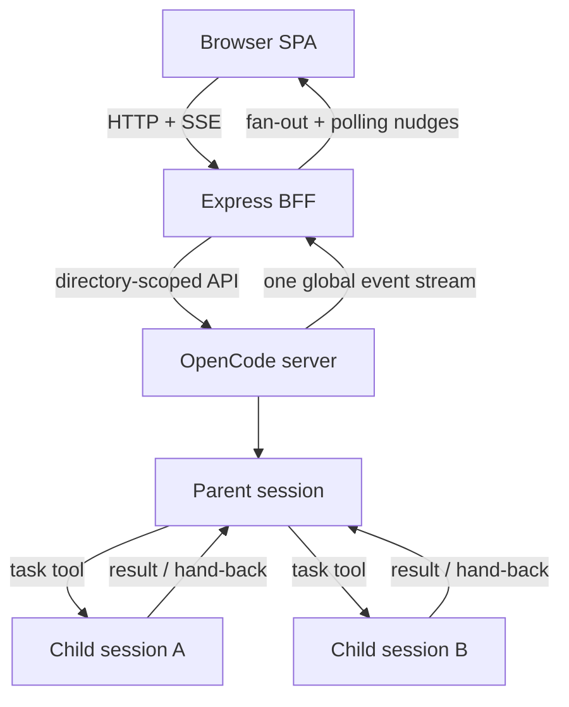
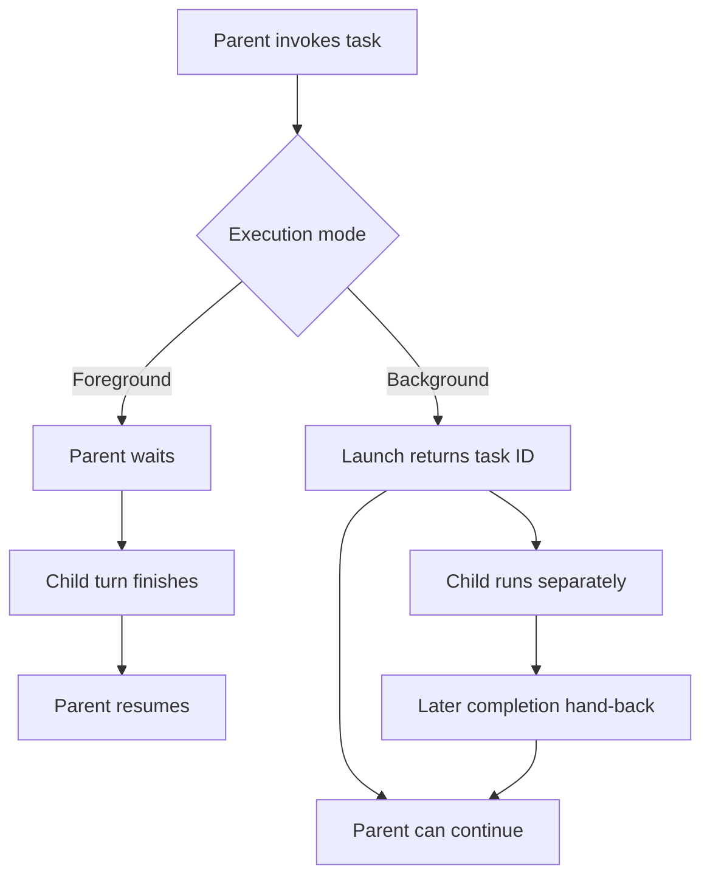
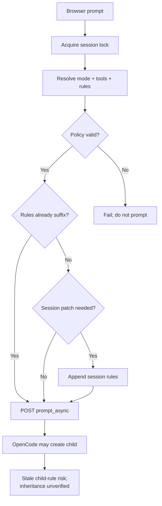

# Sub-agents and child sessions

This guide explains delegated work in custom-dca-opencode: what creates a child session, how
the browser observes it, where Plan/Build permissions apply, and when a separate Git worktree
is the safer form of parallelism.

The important boundary is that OpenCode owns sessions and task execution. This application
adds a browser UI, a credential-holding BFF, and a derived view of child state; it is not a
durable background-job scheduler.

## Terminology

| Term | Meaning in this repository |
|---|---|
| **Task-tool sub-agent** | An OpenCode agent invoked by a parent turn through a delegation tool. OpenCode normally creates a child session for it. The child session has a `parentID` pointing to the parent. |
| **Parent session** | The session whose agent invoked the delegation tool. Parent and child remain separate transcripts. |
| **Foreground task** | A synchronous delegation. The repository's adapter treats a completed foreground task part as terminal because its supported contract says the parent call waited for the child. |
| **Background task** | An asynchronous delegation. Launch returns quickly and the workflow reports a task identifier; completion arrives later. A completed launch part does **not** prove that the child finished. |
| **Independent worker session** | A separately started OpenCode session, usually in its own Git worktree and branch. It is not a task-tool child unless it was created with a `parentID`. |
| **Session todo** | A checklist item from `GET /session/{id}/todo`. Todos organize one session; they do not execute work or create sessions. OpenCode 1.18.21 todos have no stable `id`. |
| **`subtask` command** | Catalogue metadata on a slash command. The UI displays whether a command is `subtask` or `primary`, but that flag is not child-session navigation and does not itself create or track a child. |
| **Sub-agent depth** | OpenCode's limit on nested delegation. This repository's project config sets `subagent_depth` to `3`. The Settings page displays the global config value read-only, which may differ from a project override. |

The durable relationship key is the **child session ID**. The derived ledger is keyed by the
session ID found in the child list and task-part metadata, not by a transcript tool-part ID.
Resuming a child can produce more than one task part for the same session.

The repository's `background-subagent` reminder asks an agent to report a task type and task
ID after launch. That human-facing launch identifier should not be confused with a durable
BFF job record: no such record exists. The UI reconciles OpenCode child session IDs instead.

## Architecture and data flow

The browser never calls OpenCode directly. Most requests carry an absolute `directory`, which
the BFF validates and forwards to the one long-lived OpenCode server. OpenCode can host sessions
for many projects in that single process.



*Figure 1. Browser-to-child data flow. The BFF fans out one upstream event stream; OpenCode,
not the BFF, normally creates task-tool children.*

`SessionSummary.parentID` models the direct parent relationship. Session listings also derive
`childCount`, and the Hub builds a recursive hierarchy from those summaries. The public browser
session-creation route creates root sessions; although the lower-level server helper accepts a
`parentID`, normal browser delegation goes through OpenCode's task tool instead.

For each browser-originated prompt, the BFF performs this sequence:

1. Validate the project directory, then resolve the directory-scoped session, agent identity, and policy.
2. Resolve and activate the requested Plan or Build policy on the addressed session.
3. Submit `POST /session/{id}/prompt_async` to OpenCode.
4. Return HTTP `202` to the browser after OpenCode accepts the prompt.
5. Let OpenCode continue the turn independently of the browser connection.
6. Observe later state through HTTP reads, with SSE events acting as refresh nudges.

The UI does not use blocking `POST /session/{id}/message`; that endpoint holds the request for
the entire agent turn. `prompt_async` returns immediately upstream and is the correct transport
for a browser that may disconnect or sleep.

## Foreground and background delegation

Foreground and background describe the relationship between the **parent turn** and a task-tool
child. They do not describe whether the browser's original prompt request blocks: browser prompts
always use `prompt_async`.



*Figure 2. Supported foreground/background lifecycle. Background launch completion and child
completion are different events.*

The derived sub-agent ledger combines four imperfect sources:

1. `GET /session/{id}/children` supplies the authoritative child list but no liveness.
2. Parent task parts supply delegation intent, agent type, background metadata, and child ID.
3. `GET /session/status` reports children currently busy in the connected OpenCode process.
4. A child's own transcript supplies the strongest terminal evidence.

The BFF resolves state in this order: observed busy state, the child's final assistant turn, a
recognized hand-back in the parent, and finally the delegating task part. A foreground task part
marked completed is accepted as completion by the current adapter. A background task part marked
completed means only that launch returned, so it is never terminal evidence.

Background hand-backs currently need defensive recognition. The observed shape is a user-role
message in the parent without an explicit synthetic marker. The server requires both a known child
session ID and an outcome word before treating such a message as completion; the client applies an
additional delegation-word check before rendering a status row. A mere mention of a child ID
settles nothing.

These lifecycle shapes are encoded in implementation comments, deterministic mocks, and tests;
the bundled reminders prescribe the corresponding orchestration workflow. They were not
independently re-probed against a live OpenCode process for this page. In particular, contributors
should not assume every OpenCode version always emits a background hand-back. Keep unknown or
missing evidence as `unknown`, not `completed`.

## Plan, Build, and permissions

Plan/Build activation applies to the session named in each browser prompt. Policy activation and
`prompt_async` submission share a process-local lock keyed by `(directory, session ID)`, preventing
two concurrent browser prompts for that session from being submitted under each other's mode.
The lock ends after asynchronous submission; it does not cover the whole agent turn or other BFF,
TUI, or direct API processes.



*Figure 3. Plan/Build activation is fail-closed and suffix-idempotent. Child policy behavior is
kept outside the verified contract.*

The activation rules are:

- **Plan:** append deny rules for every discovered tool outside the read-oriented allowlist.
- **Build:** project the resolved Build agent's wildcard and tool-specific rules onto all
  discovered tools. Activation fails if the policy does not cover every tool. The BFF appends
  these rules when restoring a session with prior Plan denials; a direct Build session without
  those denials continues under its resolved agent policy without a session patch.
- **Append-only ordering:** the implementation and deterministic OpenCode mock model session
  permission patches as appended rules with last-match-wins precedence. Broad rules must precede
  specific overrides.
- **Suffix idempotence:** if the current permission list already ends with exactly the desired
  rules, activation does not append another copy.
- **Fail closed:** catalogue, session, agent-policy, identity, validation, or patch failure prevents
  `prompt_async` delivery.
- **No legacy `tools`:** prompt bodies omit the legacy `tools` override because non-empty overrides
  persist as session permission rules and can leave later Build turns unexpectedly denied.

There are two evidence limits to preserve when changing this code:

- The append-only and last-match-wins behavior is exercised by the repository's OpenCode mock and
  reflected in policy ordering, but the bundled 1.18.21 live API audit did not record a behavioral
  permission-patch probe. Re-verify against the live contract before changing the algorithm.
- Child mode and permission inheritance are **not verified**. The BFF activates only the addressed
  session and does not create task-tool children or capture their initial rules. Do not claim that
  children inherit the parent's mode, dynamically follow later mode changes, or remain fixed at a
  creation-time snapshot. Existing children retaining stale permissions after a parent mode change
  is a risk to test, not established behavior.

## Events, polling, and completion

The BFF owns one upstream `GET /global/event` connection. Unlike directory-scoped `/event`, the
global stream wraps events with their project directory. The BFF unwraps unknown event types
safely and fans events out over `/api/events`; project clients request a directory filter. Events
without a directory are still forwarded because they cannot be reliably assigned.

Classic SSE has no replay cursor. Event delivery is therefore a **nudge**, not the source of truth:

- An open conversation polls session state every 3 seconds and polls immediately on relevant SSE
  events. Hidden tabs skip interval ticks and refresh when visible again.
- The Hub polls its session list every 10 seconds.
- While the sub-agent tab is active, its panel polls every 10 seconds when it has `running` or
  `launched` rows; it also has a manual Refresh action.
- Both upstream and browser SSE connections retry with bounded backoff.
- Reconnection itself does not synchronously refetch in the conversation hook. The standing poll
  or a subsequent event reconciles state, so documentation and UI must not imply replay.

There is no durable background-job list. `/session/status` is local to the connected OpenCode
process, and absence does not mean completion. The sub-agent endpoint therefore derives a report
on each request and can return `unknown`. Child transcript probing is bounded to protect the BFF;
the response marks `truncated` when older children were not inspected.

The notification service recognizes general idle, error, permission, and question events. It does
not define a guaranteed background-child-completion notification class. A recognized parent
hand-back can update the transcript and derived ledger, while a child idle event may produce only
a generic idle notification.

## Current UI behavior and gaps

Implemented behavior:

- Task invocation remains an ordinary transcript tool row. When child metadata is present, the row
  includes an **Open sub-agent** link and is not collapsed into an action group.
- The Hub nests child summaries beneath parents, labels child sessions, and shows direct child
  counts. Visual indentation is capped so deep trees remain readable.
- A child conversation shows a parent breadcrumb. Follow-up prompts in that transcript remain in
  the child and do not reach the parent.
- The Details view has a dedicated delegated-work panel with derived state, evidence, agent,
  background flag, cost, transcript link, manual refresh, and eligible Stop/background controls.
- `GET /api/sessions/{parent}/subagents` exposes the derived ledger. There is no literal public BFF
  `/children` passthrough; the richer route wraps upstream child data with status evidence.
- Pending question views and mutations are session-owned. Permission requests are fetched for the
  directory and filtered to the current session in the conversation UI; the permission reply route
  itself is keyed by directory and request ID rather than a parent session path.

Known gaps and limits:

- The panel shows coarse derived state, not live child steps or aggregated child todos.
- OpenCode exposes no durable background-job registry, and a server restart can leave a child
  `unknown` even when the session still exists.
- Only children reported busy by the connected process can be stopped. Background promotion is
  shown only when the connected server advertises the experimental capability.
- Automatic sub-agent polling stops once no row is `running` or `launched`, and transcript/SSE
  updates do not independently restart that poll. A newly delegated or `unknown` row may require
  manual refresh or leaving and reopening the sub-agent tab.
- Transcript probes are capped, so older unresolved rows can remain unknown. The UI discloses
  truncation instead of implying completion.
- Parent/child links are direct relationships, not a durable job graph with retries, queues, or
  cross-process ownership.

The proposed [persistent side-agent conversations RFC](persistent-side-agents-rfc.md) describes
an application-owned correlation and answer-delivery bridge for reusable, multi-turn specialists.

## Choosing a parallelism model

| Need | Prefer | Why |
|---|---|---|
| Independent, read-only research within one turn | Task-tool sub-agents | They isolate context and can return concise evidence to one parent. Split by non-overlapping source or question. |
| One result is required before the parent can proceed | Foreground task | The parent waits and can consume the result immediately. |
| Independent work can finish later | Background task | The parent can continue, provided the work needs no immediate back-and-forth and completion uncertainty is acceptable. |
| Several code changes on different branches | Native Task children in separate worktrees | Git indexes, branches, and working files are isolated while OpenCode retains the parent/child relationship and hand-back behavior. This requires the guarded workflow below. |
| A checklist inside one session | Todos | Todos express progress only; they do not create concurrency. |
| A reusable slash-command classification | `subtask` metadata | It describes the command catalogue, not execution state or navigation. |

### Safe parallel edits

Task children can edit an allowed sibling worktree, but access permission does not move the child
session into that directory. Relative edits, default shell CWD, LSP, VCS, snapshots, configuration,
and event envelopes remain scoped to the parent instance. A mutating child must therefore treat its
assigned absolute worktree path as a hard boundary.

Use a fresh Build-only parent for mutating children. During workflow validation, children launched
from a parent that had previously activated Plan retained terminal Bash denies even after Build made
the parent's own tools available again. Until child permission inheritance is fixed and verified,
failed preflight means stop; do not weaken policy or silently replace the native child with an
independent root session.

Before launching parallel mutating workers:

1. Assign explicit file ownership and do not let two workers edit the same file.
2. Give each worker an absolute worktree path, branch, objective, exclusions, and verification
   commands. Require every Bash call to set that path as `workdir` (or use `git -C`) and require
   absolute paths for every read, edit, and patch.
3. Before edits, tests, commit, and push, require `pwd`, `git rev-parse --show-toplevel`, and
   `git status --short --branch`. Stop without mutation unless both resolved paths equal the
   assigned worktree.
4. Identify resources that worktrees still share: fixed ports, external services, global caches,
   credentials, databases, and state outside the worktree.
5. Allow only one worker to own a fixed-port stack or shared mutable service at a time.
6. Keep commits scoped to the assigned files; review before combining branches.
7. Never treat a background launch result as permission to duplicate its work in the parent.

The [parallel research handoff reminder](../reminders/parallel-research-handoff/SKILL.md) gives a
full research-to-worktree workflow. The [background delegation reminder](../reminders/background-subagent/SKILL.md)
and [deep research reminder](../reminders/deep-research-subagents/SKILL.md) provide narrower prompt
contracts. For mutating native children, inject the
[native worktree subagents reminder](../reminders/native-worktree-subagents/SKILL.md) before
delegating.

## Contributor verification checklist

When changing child-session behavior:

1. Verify endpoint and payload assumptions against the connected OpenCode server's `GET /doc`.
2. Preserve child identity by session ID and coalesce resumed task parts.
3. Keep background launch completion distinct from child completion.
4. Preserve state evidence and the honest `unknown` result.
5. Check parent ownership before mutating or aborting a child.
6. Test nested Hub rows, breadcrumb navigation, transcript links, the delegated-work panel, and a
   mobile viewport.
7. Test concurrent opposite-mode prompts, activation failure, repeated activation, and omission
   of legacy `tools`.
8. Run:

   ```bash
   npm run typecheck
   npm test
   npm run test:e2e
   ```

For the broader system boundary, see [Architecture](architecture.md). For the pinned live endpoint
evidence, see the [OpenCode 1.18.21 API audit](opencode-1.18.21-api-audit.md).
